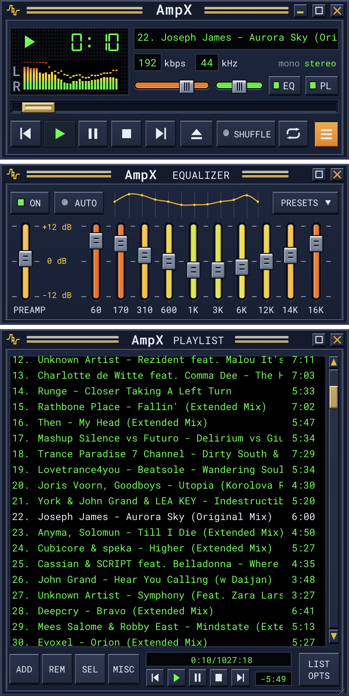
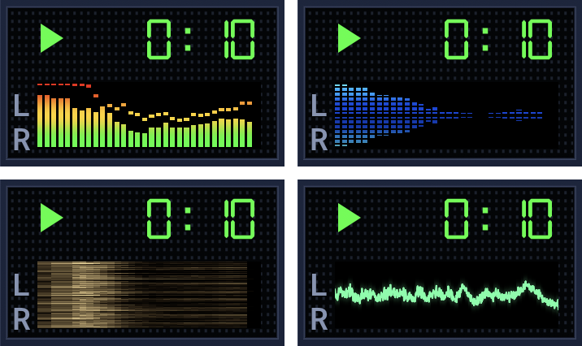

# AmpX

*Modern audio player. Classic spirit.*

A native macOS music player with the Winamp workflow (compact player, equalizer, playlist, visualizer) for local music libraries.

> AmpX is based on a fork of [`mbrukman/winamp-macos`](https://github.com/mbrukman/winamp-macos) (by Matt Greenwood, MIT), a tribute to the original Winamp by Nullsoft.
> Development continues at [`ratovarius/ampx`](https://github.com/ratovarius/ampx).



## Features

- MP3, FLAC and WAV playback
- 10-band equalizer with presets and Winamp `.eqf` import
- Playlist with M3U load/save, drag and drop, sort and multi-select
- Mini visualizer with 8 modes and color palettes
- Modules stack in one window; detach, reorder or collapse any of them
- Media keys and macOS Now Playing



## Quick start

Requires macOS 26.0+ to run. Building needs Xcode 26.4+.

```bash
./build.sh --run
```

## Docs

- [USAGE.md](USAGE.md): how to use the app
- [BUILDING.md](BUILDING.md): build, test, lint
- [RELEASE.md](RELEASE.md): cut a release

## Credits

- [`mbrukman/winamp-macos`](https://github.com/mbrukman/winamp-macos): the upstream project, © 2024 Matt Greenwood
- [Webamp](https://github.com/captbaritone/webamp) ([webamp.org](https://webamp.org/)): reference for the classic Winamp 2.x layout
- Winamp by Nullsoft: the original

## License

MIT.
