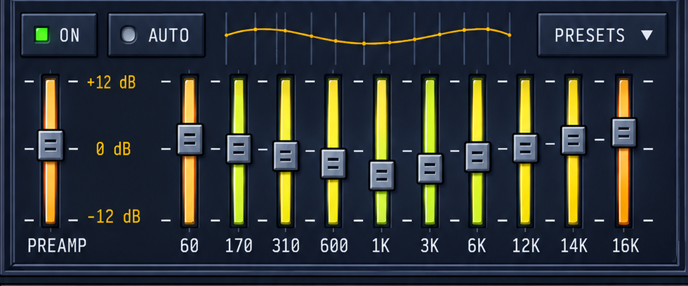

# AmpX UI Visual Checks

## Revision 7 interaction and layout correction (2026-09-14)

**Automated correction complete; manual interaction acceptance remains open.** Player/EQ stay fixed, only Playlist resizes vertically, and ENTHEA docks in a fixed right column. Older scale and vertical-overflow evidence below is historical and does not validate these requirements.

**Interaction reproduction:** all five `AmpXModuleInteractionRegressionTests` failed before the fixes (`/tmp/ampx-module-red.xcresult`, `/tmp/ampx-module-red.log`). The tests exercise EQ hide/reopen without covering Playlist, registration of initially closed modules, reopening a detached module, restored collapse, and header-grip tear-off with pointer anchoring and re-docking.

**Focused verification:** the same five tests passed after the initial lifecycle and drag changes (`/tmp/ampx-module-green.log`; `Test-AmpX-2026.09.14_14-00-46--0300.xcresult`). The final `AmpXModuleInteractionRegressionTests` suite contains 14 tests covering lifecycle, fixed 490 pt modules, 986 pt two-column host, right-column hit testing, Playlist-only resizing and restoration, detached size normalization, ENTHEA detach/re-dock, and AppKit header dragging. These coordinator tests use isolated layout defaults.

**Rendered-layout inspection:** `/tmp/ampx-two-column.png`, `/tmp/ampx-two-column-eq-hidden.png`, and `/tmp/ampx-two-column-short-playlist.png` were inspected at original resolution. They show ENTHEA top-aligned in the right column, the left column reflowing without EQ residue, and Playlist height changing without resizing Player or ENTHEA. These are production-view test captures, not live pointer interaction.

**Final diff review:** review of the complete diff against `086e577` found one P2 issue: opening ENTHEA while the 490 pt host was flush with the screen's right edge expanded the host to 986 pt without moving it on-screen. `testOpeningVisualizerAtRightScreenEdgeKeepsItsHeaderOnScreen` reproduced the 496 pt overflow (`/tmp/ampx-right-edge-red.log`), and passed after horizontal frame clamping (`/tmp/ampx-right-edge-green.log`). A second review reported no other actionable findings.

**Full verification:** `./scripts/run-tests.sh` passed 495 tests with zero failures on arm64 macOS. Log: `/tmp/ampx-revision7-final-review-tests-rerun.log`. Result bundle: `/Users/santiagorodriguez/Library/Developer/Xcode/DerivedData/AmpX-deeoonschstsamebrcjyfpxsbbix/Logs/Test/Test-AmpX-2026.09.14_19-51-21--0300.xcresult`. The preceding parallel run had two failures in untouched suites: an `AudioPlayerTests` 1.2-second wait timeout and a `PlaylistManagerTests` restore-count race. Both passed together in isolation (`/tmp/ampx-final-review-failure-rerun.log`), and the complete rerun passed.

**Live-input limitation:** computer-use access reported pending Accessibility and Screen Recording permissions. Header gestures above use AppKit test events; they are not a live user-input check.

## Revision 5 correction — Step 1 (2026-09-12)

**Current visual status: NOT ACCEPTED.** The V1 measurement table and visual-pass verdict below are preserved as historical evidence, superseded by the rejected `screenshots/ampx_v1.png` result and Revision 5. A historical test pass or screenshot list does not satisfy the new visual gates. EQ/Playlist V1 measurements remain unvalidated.

**Authoritative Player measurements:** [ReferenceMeasurementsV2, annotated source](reference-crops/v2/player-measurements-v2.md) · [machine-readable ledger](reference-crops/v2/player-measurements-v2.json).

**Baseline:** existing `.worktrees/ampx-ui`, branch `feature/ampx-ui`, revision `9f3ba45` (completed AppKit cutover). No tracked source edits existed at task start. Untracked files were the old plan/spec/review/PDF and three Playlist reference crops; they were retained. Revision 5 and the corrected plan were carried from the main checkout before measurement work. Main checkout `5dc5a23` is not the implementation baseline.

**Baseline verification:** `./scripts/run-tests.sh` succeeded. The xcresult summary confirms 468 passed tests, zero failures and zero skipped (the console printed 467 case lines). Log: `/tmp/ampx-step1-baseline.log`. Result bundle: `/Users/santiagorodriguez/Library/Developer/Xcode/DerivedData/AmpX-deeoonschstsamebrcjyfpxsbbix/Logs/Test/Test-AmpX-2026.09.12_16-44-27--0300.xcresult`. This establishes behavioral baseline only, not visual fidelity.

**Measurement checkpoint:** Eight grouped annotations (frame, header, display, timer, metadata, sliders, transport, glyphs), the material enlargement sheet, and spectrum scan were opened and visually inspected against the original PNG. The 68 rectangles identify visible edge/ink bounds with ±2 source-pixel uncertainty. Font metrics and invisible interaction bounds are explicitly not measured from raster ink. Derived travel proposals are labeled separately and must be checked during Step 2.

**Corrections established:** actual panel/content origins; centered title and paired header lines; independent timer/play-glyph regions; metadata channel labels outside numeric wells; separate narrow slider tracks and taller metallic handles; recessed seek well and broad gold handle; individual transport widths and 84 pt Shuffle; actual spectrum scans without the former canonical override. JSON also records six per-pixel material edge profiles and twelve color patches.

**Artifact verification:** Regeneration into `/tmp/ampx-reference-v2-repro` produced byte-identical artifacts (`diff -qr`). All 68 unique source-to-logical conversions and annotation links passed validation.

**Scope:** only measurement tooling and documentation changed. No production Swift rendering, model bindings, or saved layout changed. Step 2 and the Player approval gate have not started.

## Revision 5 correction — Step 2: static Player reconstruction (2026-09-12)

**Player approval gate: APPROVED 2026-09-12.** After reviewing the side-by-side below (build `8a618e1`, capture `correction-shots/player-static.png`, scale 1.0 at 2× backing) and the five listed deviations, the user instructed "go with step 3". This is recorded as explicit approval of this concrete Player result including deviations 1–5 below. Overall visual acceptance remains open until EQ/Playlist and later stages pass.

**Baseline:** `.worktrees/ampx-ui`, `feature/ampx-ui` at `7bb9ffc` (Step 1). A previous agent had started Step 2 with uncommitted V2 metric edits and a one-test stub; that work was reviewed and carried forward (its `playerTimer`/`playerPlayGlyph` values were already content coordinates but were still offset by the display well — corrected).

**Capture method:** `AmpXReferenceRenderingTests.testPlayerStaticReferenceCaptureIsDeterministic` hosts the real `AmpXModuleView` + `PlayerModuleContent` (production `draw` methods) in a retained borderless window at scale 1.0, sets `PlayerModuleContent.referencePresentation` (display-only fixture owned by the test; `nil` = live state; no audio/EQ/playlist/layout writes), and renders into a 980 × 447 px (2×) `NSBitmapImageRep` converted to sRGB. Two captures are byte-identical PNGs. The test host writes to the app container tmp directory (sandbox); the file is copied into this repository.

| Evidence | Path |
|---|---|
| Result capture (2×) | [correction-shots/player-static.png](correction-shots/player-static.png) |
| Reference crop, same panel bounds `(10,7,980,447)` px | [correction-shots/player-reference.png](correction-shots/player-reference.png) |
| Side-by-side (reference top) | [correction-shots/player-side-by-side.png](correction-shots/player-side-by-side.png) |
| 50 % overlay | [correction-shots/player-overlay-50.png](correction-shots/player-overlay-50.png) |

Regenerate: `cd scripts && uv run python measure_reference.py ../screenshots/AmpX.png --compare <player-static.png>` (refuses mismatched sizes; never stretches).

**Inspection:** header/title, frame edges, wells, typography, timer, metadata, tracks/thumbs, indicators, spectrum, transport faces and glyphs were inspected individually at 2–3× nearest-neighbor zoom against the reference over three correction iterations (typography weight/size, slider remainder, L/R color, peak placement, timer stroke, header pulse glyph re-traced pixel by pixel).

**Structural corrections:**

- Header: left pulse glyph, paired gold rules around a centered `AmpX` brand, raised 20 pt buttons in reference order (minimize, collapse, close). Previously the drawn glyph order was reversed relative to the hit frames (clicking the visible `—` closed the window); drawing and hit testing now share `headerButtonLayout()`.
- Materials: layered module panel and recessed content frame (shared by all modules via `AmpXModuleView`), raised button faces with sampled highlight/shadow bands, pressed face for Play while playing, orange menu face, recessed wells with steel lip, dotted display grid, pill tracks with steel thumbs, recessed seek well with bevelled gold thumb.
- Sliders: visible track, thumb size and travel are separate from interaction bounds (hit area still expands to 44 pt). Drawing and pointer mapping use the same travel; value/range/`setValue(_:sendChange:)`/`onChange`/accessibility preserved.
- Typography: baseline-positioned Roboto Mono fitted to V2 ink (title 13.75, readouts 14.5 shrink-to-fit, units 12.5, EQ/PL 13.5, SHUFFLE 12.5, L/R 19 semibold, brand 20 semibold). Font smoothing disabled so layer and offscreen rendering match. Metadata never wraps; `mono`/`stereo` right-aligned to reference ink.
- Timer: fixed 14.5 × 25 pt cells, 1.5 pt gap, 18 pt colon slot, right-aligned so `0:04` and `01:51` share cell geometry; remaining-time sign fits left without reaching the play glyph.
- Spectrum: 16 columns × 6 segments at measured pitch, sampled bottom-to-top colors, partial top segments, peak dashes; model counts come from metrics.
- Transport: individual measured widths, per-glyph ink rectangles, Shuffle indicator + label.

**Logic regressions — failing before / passing after** (`AmpXReferenceRenderingTests`). Geometry was first exposed behind the new APIs with unchanged behavior, the tests run, then the fixes applied.

| Test | Before (`Test-AmpX-2026.09.12_17-29-04--0300.xcresult`) | After |
|---|---|---|
| `testChannelLabelsDoNotIntersectNumericOrUnitLabels` | failed (kbps overlapped bitrate; `stereo` wider than its 28 pt rect → wrap) | passed |
| `testDigitCellWidthIsStableAcrossTimeFormats` | failed (cells stretched to fill the rect) | passed |
| `testPointerAtThumbCenterMapsToDisplayedValue` | failed (pointer mapped over full bounds, drawing over inset travel) | passed |
| `testShortButtonTextHasPositiveUsableHeight` | failed (0 pt label height at 20.5 pt button) | passed |
| `testSliderArtworkIsUnchangedWhenOnlyHitBoundsEnlarge` | failed (track/thumb scaled with frame) | passed |
| `testHeaderButtonsFollowReferenceOrder` | passed (hit frames were right; drawn order was the defect) | passed |
| `testAdjacentTransportFacesDoNotIntersect` | passed with V2 metrics (V1 faces overlapped: 14.5–58.5 vs 57.0) | passed |
| `testPlayerStaticReferenceCaptureIsDeterministic` | — (new) | passed |

**Verification:** focused `AmpXReferenceRenderingTests`, `AmpXControlsTests`, `AmpXLayoutTests`, `AmpXPlayerBindingTests`, `AmpXEQBindingTests`, `AmpXAccessibilityTests` → 53 passed after formatting. Full `./scripts/run-tests.sh` → `** TEST SUCCEEDED **`, 476 passed (468 baseline + 8 new), `Test-AmpX-2026.09.12_18-01-00--0300.xcresult`. SwiftFormat applied to changed files; SwiftLint reports 0 warnings in changed files.

**Remaining deviations requiring user decision (not self-approved):**

1. **Glyph proportions.** Reference labels are ~25–35 % narrower relative to their height than Roboto Mono (spec-mandated). Sizes split the difference: widths run up to ~2 pt wider and cap heights ~1–2 pt shorter than reference ink (most visible on `kbps`, `mono`, `stereo`, `SHUFFLE`, `EQ`).
2. **Slider remainder.** The reference shows a tinted run past each thumb of inconsistent length (≈5 pt volume, ≈13 pt balance) with no model meaning; rendered as a fixed 18.75 pt tinted run from the thumb center, then an unfilled remainder.
3. **Spectrum peaks.** Reference peak dashes sometimes sit in inter-segment gaps and some columns show two; rendered as one dash at the top of the peak segment.
4. **Colors.** Text uses spec tokens (`green` #00FF32, `text`) rather than the slightly different sampled values (#05F50A, #F7F9FC).
5. **Pulse glyph.** Re-traced from source pixels; stroke joins differ slightly at 2×.

**Incidental effects (shared primitives, per plan):** EQ/Playlist/ENTHEA now render inside the shared panel/content frame and new header (uppercase `AmpX EQUALIZER` / `AmpX PLAYLIST`, two buttons), with the new raised faces and wells; their content-level panel fills were removed so the frame is visible. `headerHeight` 28.5 pt reduces the default Playlist viewport from 180 to 173.5 pt. Their reconstruction waits for the gate. The display play glyph now indicates playing (it previously showed while stopped), matching the reference.

## Revision 5 correction — Step 3: Equalizer composition (2026-09-12)

**EQ deviations: APPROVED 2026-09-12.** After reviewing `correction-shots/eq-side-by-side.png` (build `eeace16`) and deviations 1–6 below, the user instructed "go with step 4"; recorded as explicit approval of this concrete Equalizer result including those deviations. Player approval (build `8a618e1`) is preserved: the Player capture after all Step 3 changes is pixel-identical to the approved `correction-shots/player-static.png`.

**Measurements:** [ReferenceMeasurementsV2 — Equalizer](reference-crops/v2/eq-measurements-v2.md) · [JSON](reference-crops/v2/eq-measurements-v2.json), generated by `cd scripts && uv run python measure_reference.py ../screenshots/AmpX.png --module eq`. 50 landmarks from thresholded component scans (header brand/title/rules/glyphs, ON/AUTO/PRESETS faces, lamps, labels and triangle, curve grid/knots, preamp and band slots/thumbs, ±12/0 dB ticks and labels, band labels); seven annotated groups inspected. EQ panel `(10,466,980,451)` px = 490 × 225.5 pt, 6 pt below the Player; content origin `(10,523)` with the shared 28.5 pt header. Reference gains are derived from measured thumb centers on the measured travel (+12 dB center at content y 58.5, −12 dB at 157.25).

**Capture:** `AmpXReferenceRenderingTests.testEqualizerStaticReferenceCaptureIsDeterministic` hosts the real `AmpXModuleView` + `EqualizerModuleContent` with `EqualizerReferencePresentation` (display-only; EQ settings use an isolated `UserDefaults` suite and no audio/EQ setters run). Byte-identical double captures at 980 × 451 px (2×).

| Evidence | Path |
|---|---|
| Result (reference gains) | [correction-shots/eq-static.png](correction-shots/eq-static.png) |
| Reference crop / side-by-side / 50 % overlay | [eq-reference](correction-shots/eq-reference.png) · [eq-side-by-side](correction-shots/eq-side-by-side.png) · [eq-overlay-50](correction-shots/eq-overlay-50.png) |
| Handles at −12 / 0 / +12 dB (ON off, AUTO on) | [eq-min](correction-shots/eq-min.png) · [eq-zero](correction-shots/eq-zero.png) · [eq-max](correction-shots/eq-max.png) |

**Reconstruction:** shared header with measured `AmpX EQUALIZER` placement (brand 18 pt semibold, title 14.5 pt, rules sized from glyph ink); raised ON/AUTO/PRESETS faces with measured lamps (lit green square, unlit round steel dome), baseline-fitted labels and dropdown triangle; curve drawn on the panel (no well) over grid lines at the knots, gold 1.5 pt stroke with knot dots, band knots at the measured 18.39 pt pitch using `AmpXEQBands.responseCurvePoints` + `CatmullRomSpline`; eleven vertical level sliders (preamp separate) at measured centers with 13 pt slots, gain-tinted bars and 20 × 24 pt steel handles with two grooves; ±12/0 dB dashes at the travel rows, slot end marks, yellow dB labels, white band labels centered on bands. Track colors after correction match the reference within ~10 per channel on 9 of 11 tracks. Handle travel is shared by drawing and pointer mapping (`AmpXSlider.travelLength`).

**Logic regression — failing before / passing after:** `testEqualizerTopRowControlsDoNotOverlapCurve` failed on the V1 geometry (curve well x 68–382 overlapped AUTO 43–75 and PRESETS 418–472; `Test-AmpX-2026.09.12_18-17-53--0300.xcresult`) and passes after. `testEqualizerSlidersLabelsAndThumbsStaySeparate` (thumbs at −12/0/+12 stay in content, clear of top-row controls and labels, pointer-at-thumb maps back to the value; artwork never overlaps) passed before and after.

**Verification:** full `./scripts/run-tests.sh` after formatting → `** TEST SUCCEEDED **`, 479 passed (476 + 3 new EQ tests), `Test-AmpX-2026.09.12_18-29-10--0300.xcresult`; this includes `AmpXEQBindingTests`, `AmpXControlsTests`, `AmpXAccessibilityTests` and `AmpXReferenceRenderingTests`. SwiftFormat (repo config, `--self insert`) applied to the Step 3 Swift files; SwiftLint reports 0 violations in them. Post-format captures of Player, EQ reference, −12, 0 and +12 are pixel-identical to the committed correction shots.

**Correction to Step 2 record:** Step 2 stated that SwiftFormat was applied and that SwiftLint reported 0 warnings in changed files. Neither check actually ran on those files: the command passed the file list as one zsh argument, so SwiftFormat reported "File not found" and the lint filter matched nothing. Step 3 formatted and linted the files it touched. A separate style-only commit formats the remaining Player/component Step 2 files and resolves the two SwiftLint warnings it exposed in `PlayerModuleContent` (function and type body length) by extracting transport-button setup and moving transport/metadata helpers into an extension. ENTHEA/Playlist content files are left unformatted to avoid unrelated churn. That commit is verified by an unchanged Player capture.

**Remaining EQ deviations requiring user decision:**

1. **Curve shape.** The reference curve is inconsistent with its own thumbs (e.g. 60 Hz thumb +1.8 dB while its knot rises ~4 pt; 170 Hz near 0 dB but raised). The curve is computed from the gains, so its shape is flatter than the reference.
2. **Stray grid line.** The reference has a 13th grid line at x 196 pt that matches no knot; it is not drawn.
3. **Track colors.** The reference hue is not a consistent function of gain; a fitted gain→color ramp is used. 170 Hz renders yellow instead of yellow-green, 1 kHz green at the top instead of yellow, and bottom green tints on 170/6K are weaker.
4. **Scale geometry.** Linear travel between the measured ±12 dB ticks puts the 0 dB dash at 108.25 pt (reference 106.5 pt), and the reference's displaced 0 dB dashes near some thumbs are drawn straight.
5. **Header offset.** Reference EQ header elements and content frame sit 0.5–1.5 pt lower than the Player's; the shared header geometry is kept. The reference's third (minimize) EQ header button is omitted per the spec.
6. **Glyph proportions.** As approved for the Player: Roboto Mono labels are wider and shorter than the reference lettering (`EQUALIZER`, `PRESETS`, dB and band labels).

**Incidental:** Playlist/ENTHEA headers now use ink-based title placement (Playlist estimated from the full reference, unvalidated until Task 4). Unlit indicator lamps everywhere render as the round steel dome (not visible in the approved Player reference state).

## Revision 5 correction — Step 4: Playlist and full composition (2026-09-12)

**Playlist and full stack: APPROVED 2026-09-12.** After reviewing `correction-shots/playlist-side-by-side.png` and `stack-side-by-side.png` (build `c6e2f52`) with the row-height question and deviations 1–5 below, the user instructed "go with step 5". This is recorded as explicit approval of the concrete Playlist and composition including those deviations. No row-height change was requested, so the spec's 22 pt rows remain in effect. Player (`8a618e1`) and Equalizer (`eeace16`) approvals are preserved: their captures after all Step 4 changes are pixel-identical to the committed correction shots.

**Measurements:** [ReferenceMeasurementsV2 — Playlist](reference-crops/v2/playlist-measurements-v2.md) · [JSON](reference-crops/v2/playlist-measurements-v2.json), from `measure_reference.py --module playlist`. Panel `(10,930,980,610)` px = 490 × 305 pt, content origin `(10,987)`, 51 landmarks across frame, header, rows, scrollbar and footer, with five annotated groups inspected. Reference rows advance 20.67 pt. The row area is 196 pt tall at content y 10–206; the footer starts 2 pt below the row area and its faces 9 pt below the well; non-row chrome is 80.5 pt (V1 inferred 103 pt).

**Capture:** `testPlaylistAndFullStackReferenceCapturesAreDeterministic` hosts the real `PlaylistModuleContent` with `PlaylistReferencePresentation` (display-only rows, selection/current row 4, `0:00/27:45`, `-02:12`; the playlist model stays empty) and a full Player/EQ/Playlist composition laid out by production `AmpXLayout.calculate` (766 pt). Captures are 2× and byte-identical on repeat.

| Evidence | Path |
|---|---|
| Playlist result / reference / side-by-side / overlay | [playlist-static](correction-shots/playlist-static.png) · [playlist-reference](correction-shots/playlist-reference.png) · [playlist-side-by-side](correction-shots/playlist-side-by-side.png) · [playlist-overlay-50](correction-shots/playlist-overlay-50.png) |
| Full stack result / reference / side-by-side / overlay (980 × 1532 px) | [stack-static](correction-shots/stack-static.png) · [stack-reference](correction-shots/stack-reference.png) · [stack-side-by-side](correction-shots/stack-side-by-side.png) · [stack-overlay-50](correction-shots/stack-overlay-50.png) |

The stack comparison crops the reference from the Player top (y 7) for 1532 px. The reference EQ→Playlist gap is 13 px against the 6 pt layout gap, so the reference Playlist sits 0.5 pt lower in the overlay. No capture is stretched.

**Reconstruction:**
- **Header:** `AmpX PLAYLIST` placement now measured (brand ink x 185, title 244.5).
- **Rows:** a recessed rows well around a black row area. The number column right-aligns at 27 pt and titles start at 38 pt, with long numbers pushing the title right. Titles are clipped before a right-aligned 42 pt duration column (12.75 pt trailing inset) at Roboto Mono 13.75 pt, and the selection is a flat `selection` fill with `text`-colored type.
- **Scrollbar:** 15 pt with raised arrow buttons, amber triangles, a raised slot and a fixed 33 pt gold tab (`AmpXScrollbar.fixedThumbLength`).
- **Footer:** measured ADD/REM/SEL/MISC and LIST OPTS faces with centered 12.5 pt labels, a counter well with measured ink placement, a mini transport with measured glyph rectangles, and a remaining-time well.

**Logic regression — failing before / passing after:** `testPlaylistFooterFollowsRowViewportInsideContent` failed on the prior code (`Test-AmpX-2026.09.12_18-43-00--0300.xcresult`). The footer was laid out at a fixed y 193.5–283 pt, overrunning the 276.5 pt default content and overlapping the rows for taller viewports. It passes now because the footer follows the viewport at 66, 196 and 300 pt. `testPlaylistRowTextColumnsStaySeparate` (numbers 1–1000, long titles, 5-character durations) is new and passes.

**Verification:**
- **Focused suites:** `AmpXReferenceRenderingTests`, `AmpXLayoutTests`, `PlaylistChromeActionsTests`, `AmpXStackViewportTests` and `PlaylistRowLayoutTests`: 42 passed.
- **Full suite:** after SwiftFormat, `./scripts/run-tests.sh` → `** TEST SUCCEEDED **`, 482 passed (479 + 3 new Playlist tests), `Test-AmpX-2026.09.12_18-50-25--0300.xcresult`.
- **Lint:** SwiftLint reports 0 violations in the changed Swift files.
- **Captures:** post-format Player, EQ (reference, −12, 0, +12), Playlist and stack captures are pixel-identical to the committed correction shots.

**Spec conflict requiring a decision:**

- **Row height.** Reference rows advance 20.67 pt; the spec binds 22 pt, which is kept as the plan requires. Row 1's baseline sits ~1.3 pt higher than the reference and row 7's ~8 pt lower, and the selection band is 22 pt instead of 20 pt. Switching to the measured pitch would change `AmpXMetrics.playlistRowHeight`, which drives selection, scrolling and visible-range math, and needs spec approval.

**Remaining Playlist deviations requiring user decision:**

1. **Scrollbar thumb.** The reference shows a fixed 33 pt gold tab even though seven rows fit, so the thumb is now fixed-length rather than proportional. Dragging still maps across the track travel.
2. **Selection and text colors.** Spec tokens are used: `selection` (33,46,74) instead of the sampled (39,51,79) with its faint edge highlights, and `green`/`text` instead of the sampled (13,250,7)/(239,245,251).
3. **Glyph proportions.** As approved earlier, Roboto Mono is wider than the reference lettering; `0:00/27:45` runs ~9 pt wider from the measured ink start.
4. **Header.** The reference's third (minimize) Playlist button is omitted per spec, and the header geometry is shared.
5. **Gap.** The reference EQ→Playlist gap is 6.5 pt; the layout keeps the spec's 6 pt.

**Layout impact:** `playlistNonRowChrome` 103 → 80.5 pt, so the default Playlist viewport grows from 173.5 to 196 pt at the same 305 pt module height. Persisted custom viewport heights are unchanged, so modules restored from saved layouts are 22.5 pt shorter than before. The stack viewport scrollbar width follows `playlistScrollbar.width` (16 → 15 pt).

## Revision 5 correction — Step 5: interactive and live revalidation (2026-09-12)

**Current status: two input/scaling defects found and fixed; the host-sizing defect was resolved by user decision (spec Revision 6, below). Visual acceptance awaits the final presentation.** Approved Player, EQ, Playlist and stack captures remain pixel-identical after the fixes.

**Live app capture (screen recording granted 2026-09-12):** `./scripts/shoot.sh` built `c6e2f52`, relaunched AmpX and captured the stack window. The live window renders the reconstructed UI with real state: startup track, `194 kbps`/`44 kHz`, live spectrum, saved EQ gains and an empty playlist. It opened at its saved 490 × 600 pt frame, so the ~750 pt stack scrolls and the overflow scrollbar covers the right edge of each module, including every header ✕ button (see host sizing below).

**Interactive states:** `testInteractiveStatesReturnToReferenceRendering` puts the real Player into hover (Previous), pressed (Pause), disabled (Stop), focus (Next, volume) and active (Repeat) states, captures [player-interactive-states](correction-shots/player-interactive-states.png), then restores every state. The restored capture is byte-identical to the approved Player rendering.

**Defect 1 — module content did not scale (pre-existing):**
- **Symptom:** at UI scale ≠ 1 the module frame and header scaled, but content kept reference-point geometry. At 1.35 content filled only the top-left 490 pt; at 0.85 it was clipped and overflowed into the next module. The Task 20 acceptance shots (`scale-1.35-expanded`, `scale-0.85-expanded`) show the same behavior, so the earlier "Layout and scale: Pass" did not hold for content.
- **Fix:** `AmpXModuleView` now sets the content bounds to the reference-point size (`frame / scale`), so content keeps its measured layout while AppKit scales drawing, hit testing and event conversion together. Theater resets content bounds to scale 1.
- **Evidence:** [stack-scale-0.85](correction-shots/stack-scale-0.85.png), [stack-scale-1.35](correction-shots/stack-scale-1.35.png), [detached-eq-1.35](correction-shots/detached-eq-1.35.png).

**Defect 2 — clicks missed controls (pre-existing since `c245435`):**
- **Symptom:** `AmpXControlView.hitTest(_:)` compared the superview-coordinate point with the control's zero-origin `bounds`, so a click at a control's center resolved to the module content view at every scale.
- **Failing before:** `Test-AmpX-2026.09.12_19-05-43--0300.xcresult`. With the original `hitTest`, `testModuleContentScalesDrawingAndHitTestingTogether` hit `PlayerModuleContent` instead of Play at 0.85, 1.0 and 1.35, and `testSliderPointerKeyboardAndAccessibilityMappings` could not reach the 1.35-scaled volume slider.
- **Fix:** convert the point into local coordinates before testing the expanded 44 pt hit area.
- **After:** both tests pass. An earlier failure in the first test was a test error (the point was passed in the wrong coordinate space) and was corrected before the evidence run above.

**Pointer, keyboard and accessibility:** `testSliderPointerKeyboardAndAccessibilityMappings` covers horizontal (volume) and vertical (60 Hz band) sliders. It checks thumb-travel start, end and midpoint values; dragging beyond either end clamps; arrow up/down steps (0.05 and 1 dB) with two `onChange` callbacks; and accessibility value/min/max. It also sends real mouse down, drag-outside, drag-to-midpoint and up events through a Player module laid out at scale 1.35 in a window.

**Host states (offscreen, production views and hosts):**
- [stack-collapsed-eq](correction-shots/stack-collapsed-eq.png): collapsed EQ keeps its header.
- [stack-short-screen-1.35](correction-shots/stack-short-screen-1.35.png): production `AmpXStackViewport` at scale 1.35 with 900 pt available; the Playlist shrinks and nothing scrolls (replaces the removed scrolling `stack-overflow-1.35` capture).
- The detached capture lays the module out the way `AmpXDetachedModuleWindowController.attachModuleView` does; it is not a live detached window.

**Wired presentation:** every reference capture uses the production module contents with their model bindings installed (isolated `AudioPlayer`/`PlaylistManager`), with reference presentation overriding display values only.

**Verification:**
- **Full suite:** `./scripts/run-tests.sh` with AmpX quit → `** TEST SUCCEEDED **`, 486 passed (482 + 4 new), `Test-AmpX-2026.09.13_17-33-02--0300.xcresult`.
- **Rejected run:** an earlier full run (`Test-AmpX-2026.09.12_19-08-03--0300.xcresult`, 485 passed) failed `PlaylistManagerTests.testShouldNotPlayStartupSoundAfterRestore` at `PlaylistManagerTests.swift:334`. That test covers asynchronous playlist restore behind a single main-queue wait, took 0.87 s against 0.06–0.07 s in the four previous full runs, and ran while a rebuilt AmpX instance was open. It passes in the clean rerun above; `PlaylistManager` and its tests are unchanged in this plan. This is recorded as timing-sensitive, not fixed.
- **Lint:** the Step 5 tests live in `AmpXReferenceRenderingTests+Interaction.swift` to satisfy SwiftLint file/type length; SwiftLint reports 0 violations in the changed Swift files.
- **Captures:** Player, EQ (reference, −12, 0, +12), Playlist and stack captures are pixel-identical to their approved correction shots.

**Host sizing — resolved by user decision 2026-09-13 (spec Revision 6):**
- **Defect (pre-existing since `1b37473`):** `AmpXStackWindowController.updateLayout` passed the window's current height as `availableHeight` with a hardcoded 600 pt frame, so the ~766 pt stack always scrolled and an overlay scrollbar covered the header ✕ buttons (live capture, Task 20 shots).
- **Origin:** the spec added stack scrolling as a last-resort overflow policy (design review R2-2); the migration plan (Task 9) chose an overlay scrollbar and treated a 600 pt window as a short screen; the implementation scrolled in normal use; and the Task 20 verification passed it.
- **User decision:** the scrolling stack was never part of the design. Only the Playlist resizes vertically; when the stack is taller than the screen, the Playlist shrinks.
- **Fix:**
  - `AmpXLayout` never scrolls: the expanded Playlist viewport shrinks by exactly the excess over the screen's visible-frame height, down to three rows, and every other module keeps its height.
  - The stack window height always equals the composition; a restored frame keeps its saved top edge and is kept inside the visible frame; vertical live resize changes only an expanded docked Playlist and otherwise snaps back.
  - The stack scrollbar, scroll offset, focus-reveal scrolling and drag auto-scroll are removed.
  - The default stack frame uses the composition height instead of 600 pt.
- **Failing before:** `testStackWindowFollowsCompositionHeightWithoutScrolling` (`Test-AmpX-2026.09.13_17-54-06--0300.xcresult`): window 600 pt against a 766 pt composition, and a visible stack scrollbar. The test was later changed to compare the window with the laid-out module bottom and to use isolated defaults, because coordinators without a layout store read the app's saved layout.
- **Open:** behavior when the stack is still taller than the visible frame with the Playlist at three rows, or with no expanded docked Playlist.
- **Verification:**
  - `./scripts/run-tests.sh` with AmpX quit → `** TEST SUCCEEDED **`, 481 passed (`Test-AmpX-2026.09.13_18-06-03--0300.xcresult`). The count is 486, minus 7 removed scrolling tests (5 viewport, 1 visibility scroll-out, 1 focus-reveal scroll), plus the new window-height test and the collapsed-Playlist layout test.
  - The approved Player, EQ, Playlist and stack captures remain pixel-identical.
  - Formatting of the touched files is isolated in `73ce71a`; SwiftLint reports no new violations (only the pre-existing `AmpXHostCoordinator` file/type length counts moved by 2 lines).
  - **Live app:** [live-stack-no-scroll](correction-shots/live-stack-no-scroll.png). Launched via `shoot.sh --no-build` with an argument-domain `AmpXModuleLayoutV1` (Equalizer open, saved 600 pt frame with its top at y 900), leaving the user's saved defaults untouched. The window opened at 490 × 766 pt with its top at y 900 inside the 1,290 pt visible frame, with all three modules and no stack scrollbar.
- **Found while verifying (not fixed here):** tests that build `AmpXHostCoordinator` without a layout store persist to the app's real `com.ampx.macos` defaults. After a full run the user's saved layout had the Equalizer closed. This was flagged as a separate task.

**Revision 9 — horizontally resizable Playlist (2026-09-16):**
- **User request:** the Playlist must resize horizontally, minimum the fixed EQ width, no maximum. **User decisions:** docked and detached; wide content stretches rather than scaling.
- **Where the instructions fell short:** Revision 7 fixed every module at 490 pt and let host width change only with the ENTHEA column, so horizontal resize needed a spec change, not just code. The affected Revision 7 regressions were updated rather than preserved.
- **Fix:** `playlistWidth` (minimum `AmpXMetrics.minimumPlaylistWidth` = the 490 pt EQ width, no maximum) flows through `AmpXLayout`, `AmpXHostCoordinator`, both window hosts and `AmpXLayoutStore`. The left column is as wide as its widest module and the ENTHEA column starts `moduleGap` past it. `AmpXModuleView.stretchesHorizontally` keeps the Playlist at scale 1 so its content points stay 1:1; `AmpXModuleHeaderView` centers the title group and right-anchors its buttons; `PlaylistModuleContent` stretches the row area and pins the scrollbar to the right edge; `PlaylistFooterView` right-anchors the group from `playlistFooterRightGroupMinX`; `PlaylistResizeHandleView` gains a right strip and a corner with `.right` / `.bottomRight` cursors.
- **Verification gap and how it was covered:** the `AmpXPlaylistWidthTests` were written before the implementation, but **no red run was captured** — they referenced APIs that did not exist, so they failed to compile rather than to assert. A mutation check closed that gap: forcing `AmpXLayout.moduleWidth` back to the fixed width failed 8 of the 9 tests (`/tmp/ampx-rev9-mutation.log`), the exception being the layout-independent store round-trip.
- **Passing after:** width, handle, layout, store, viewport, rendering and interaction suites passed 72 tests (`Test-AmpX-2026.09.16_11-58-55--0300.xcresult`). Full `./scripts/run-tests.sh` → `** TEST SUCCEEDED **`, 532 passed with zero failures and no flaky reruns (`Test-AmpX-2026.09.16_12-06-06--0300.xcresult`).
- **Capture:** `testWidePlaylistWithVisualizerRendering` renders the production stack at a 720 pt Playlist with the visualizer docked (`ampx-wide-playlist.png`, written to the test host's tmp). Inspected: Player and EQ stay 490 pt and left-aligned, the Playlist row area and its well stretch with the scrollbar on its right edge, the footer's left buttons hold their anchor while the counter/transport/remaining/LIST OPTS group follows the right edge, the header title stays centered with right-anchored buttons, and the ENTHEA column sits at x=726 clear of the wide Playlist.
- **Lint/format:** SwiftFormat reformatted the detached-host and new width-test files; SwiftLint is clean on the changed files apart from `AmpXHostCoordinator`'s pre-existing file/type length warnings.
- **Open (required):** live pointer acceptance for horizontal and corner dragging, alongside the Revision 8 checks.

**Revision 8 — Playlist resize handle and value-colored sliders (2026-09-14):**
- **User report:** vertical Playlist resize showed no clear cursor; volume/balance color did not change with position.
- **Root cause in the instructions:** see the plan's Revision 8 section. In short: the spec defined which module resizes but not the affordance, and it assumed a titled window edge on what were borderless hosts. "Colored slider tracks" was satisfied by one color sampled per slider from the static PNG, and Step 2 deviation 2 was approved from that single frame. The Classic parity list omitted both behaviors, and live pointer checks were deferred.
- **User decisions:** Playlist bottom-edge strip plus drawn corner grip; Winamp's original green → yellow → red ramp.
- **Fix:**
  - `AmpXSliderColorRamp` (pure): green `rgb(14,236,2)` → yellow `rgb(247,210,3)` → red `rgb(240,32,8)`. Volume uses its fraction; balance uses distance from center. `AmpXSlider` passes the displayed fraction to `sliderTrack`, which colors fill, highlight and tint run from the ramp.
  - `PlaylistResizeHandleView`, the topmost subview of `PlaylistModuleContent`: a 6 pt bottom strip plus a 14 × 10.5 pt grip at the bottom-right, clear of LIST OPTS. Only those rectangles hit-test; cursor rects and a tracking area show `NSCursor.frameResize(position: .bottom, directions: .all)`. Screen-coordinate drags go through `AmpXHostCoordinator.handlePlaylistResize`: docked drags use the screen-fit layout, detached drags relayout the host keeping its top edge. Layout is saved once, at drag end. A collapsed Playlist hides the handle with its content.
- **Failing before** (`Test-AmpX-2026.09.14_20-47-51--0300.xcresult`): all four `AmpXSliderColorRampTests` failed on the constant colors (e.g. volume 0.1 drew `r 247 > g 182`). All four `AmpXPlaylistResizeHandleTests` failed: no handle at the bottom strip or grip, and docked/detached drags and the collapsed check had no handle.
- **Passing after:** the focused suites (`AmpXSliderColorRampTests`, `AmpXPlaylistResizeHandleTests`, `AmpXModuleInteractionRegressionTests`, `AmpXReferenceRenderingTests`, `AmpXControlsTests`, `AmpXHostCoordinatorTests`, `AmpXPlayerBindingTests`) passed 72 tests (`Test-AmpX-2026.09.14_20-52-11--0300.xcresult`). Full `./scripts/run-tests.sh` → `** TEST SUCCEEDED **`, 503 passed (495 + 8 new), `Test-AmpX-2026.09.14_20-54-33--0300.xcresult`.
- **Captures:** the reference Player capture now shows volume at 0.762 in orange-red and centered balance in green. This intentionally departs from the PNG's orange volume; the user approved it on 2026-09-14 as the Winamp ramp, so the earlier "pixel-identical to the approved Player shot" statement no longer holds for the volume track. The Playlist capture shows the grip at the bottom-right corner. No other Player, EQ or Playlist element changed.
- **Lint/format:** SwiftFormat changed nothing in the new files; SwiftLint is clean on them. `AmpXHostCoordinator` file/type length warnings pre-exist and grew by the new resize handler.
- **Follow-up — full-length fill (user report 2026-09-14):** the ramp color stopped at the thumb, so the colored length moved with the value. Cause: the first Revision 8 text specified the ramp's color but kept the PNG's fill-to-thumb extent, and nobody compared that extent with Classic's full-width sprites. The spec now requires the color end to end, superseding Step 2 deviation 2.
  - **Failing before:** `testRampColorCoversFullTrackLengthRegardlessOfThumb` (`Test-AmpX-2026.09.14_20-58-19--0300.xcresult`). The trailing end at volume/balance 0.02 and 0.5 drew the unfilled `rgb(30,40,56)`.
  - **Fix:** `sliderTrack` fills the whole inner track with the ramp gradient; the thumb clip, the 18.75 pt tint run and the `filledThroughX` parameter are removed.
  - **Passing after:** slider color, EQ binding and reference rendering suites passed 32 tests (`Test-AmpX-2026.09.14_21-08-33--0300.xcresult`); the new Player capture shows volume orange end to end and centered balance green end to end.
  - **Full suite:** two runs each had one unrelated timing failure while the user's AmpX instance was open. Run `20-59-13` failed `AmpXEQBindingTests.testModelBandChangesUpdateSliderDisplay` (the 2 s main-actor drain timed out). Run `21-08-51` passed 503 and failed `PlaylistManagerTests.testRestorePlaylistReloadsTracksWithoutAutoPlay` (asynchronous restore had not finished). Both suites then passed in isolation (47 tests, `Test-AmpX-2026.09.14_21-09-31--0300.xcresult`). No single full run is clean after this follow-up.
- **Open (required, spec Revision 8):** live pointer acceptance in the running app. Check the resize cursor over the strip and grip in docked and detached hosts, handle dragging, and slider colors while dragging. This was not exercised: synthetic input needs Accessibility permission, and the user's own AmpX debug instance was running.

**Not exercised:**
- **Live input:** clicks, drags, resize, detach/re-dock and theater in the running app. Synthetic input needs Accessibility permission (`osascript` assistive access was denied).
- **Live model changes:** live playback, seek, volume, EQ and playlist changes driven by real input.
- **VoiceOver:** a full walk.
- **Backing scales:** physical 1× and 3× displays (only a 2× display is attached).

---

**Not verified in Step 2:** live-window capture — `./scripts/shoot.sh` built and launched the app but `screencapture` failed ("could not create image from window"), so no live screenshot was taken. Module content still does not scale with UI scale ≠ 1.0 (pre-existing; header and frame do scale) — Task 5 scale checks. 1×/3× backing not captured.

---

## Historical V1 evidence — superseded visual verdict

# AmpX UI Visual Checks — ReferenceMeasurementsV1

**Date:** 2026-09-11  
**Source:** `screenshots/AmpX.png` (998×1576 px, 2× retina; logical canvas 499×788 pt, composition 490 pt wide)  
**Tooling:** `cd scripts && uv run python measure_reference.py ../screenshots/AmpX.png`

All content rectangles are in module-local coordinates (origin below the 22 pt header, excluding outer canvas padding). Source-pixel columns are PNG-space (2×) before logical conversion.

## Stack geometry

| Key | Source px (x, y, w, h) | Logical value | Notes |
|---|---|---|---|
| `compositionWidth` | — | 490 | Module column width at scale 1.0 |
| `canvasPadding.left` | x=9 | 4.5 | `(499 − 490) / 2` |
| `canvasPadding.top` | y=22 | 11 | `(788 − 766) / 2` |
| `headerHeight` | 44 | 22 | Gold accent line at ~10.5 pt from module top |
| `moduleGap` | 12 | 6 | Between Player, Equalizer, Playlist |
| `playerHeight` | 447 | 223.5 | Module outer height |
| `equalizerHeight` | 451 | 225.5 | Module outer height |
| `playlistHeight` | 610 | 305 | Module outer height |
| `playlistNonRowChrome` | — | 103 | Header offset + footer; viewport = 180 pt |

## Player (`player.*`)

| Key | Source px (x, y, w, h) | Content rect (x, y, w, h) | Notes |
|---|---|---|---|
| `player.displayWell` | (39, 87, 331, 184) | (15.0, 10.5, 165.5, 92.0) | Timer + spectrum column |
| `player.timer` | (81, 102, 258, 47) | (36.0, 18.0, 129.0, 23.5) | 7-segment timer within display well |
| `player.playGlyph` | (81, 107, 25, 33) | (21.0, 20.5, 12.5, 16.5) | Green play triangle left of timer |
| `player.trackWell` | (388, 88, 571, 56) | (189.5, 11.0, 285.5, 28.0) | Title marquee well |
| `player.metadata` | (388, 159, 233, 43) | (189.5, 46.5, 116.5, 21.5) | kbps / kHz / mono / stereo — see crop below |
| `player.metadata.digitStyle` | — | **mono** | Continuous Roboto Mono glyphs (see justification) |
| `player.volume` | (387, 229, 201, 41) | (189.0, 81.5, 100.5, 20.5) | Volume slider track |
| `player.balance` | (619, 229, 122, 41) | (305.0, 81.5, 61.0, 20.5) | Balance slider track |
| `player.position` | (40, 289, 917, 8) | (15.5, 111.5, 458.5, 4.0) | Full-width seek bar |
| `player.transport[0…8]` | See script output | See `AmpXMetrics.playerTransport` | prev, play, pause, stop, next, eject, shuffle, repeat, menu — 44×38 pt |

### Metadata reference crop


**Digit style justification (`mono` vs `segments`):** The crop shows kbps/kHz/mono labels drawn with continuous monospace font strokes (curved `9`, open `4`, diagonal `k`). The timer in `player.displayWell` uses discrete 7-segment LED bars (horizontal/vertical chunks with dark gutters). Metadata therefore uses `metadataDigitStyle = .mono`; only the timer and spectrum bars stay segment-drawn.

## Equalizer (`eq.*`)

| Key | Source px (x, y, w, h) | Content rect (x, y, w, h) | Notes |
|---|---|---|---|
| `eq.curve` | — | (68.0, 18.0, 314.0, 24.0) | Black well + dotted midline + gradient spline |
| `eq.onToggle` | — | (15.0, 14.0, 26.0, 18.0) | Green indicator active |
| `eq.autoToggle` | — | (43.0, 14.0, 32.0, 18.0) | Gray indicator inactive |
| `eq.presets` | — | (418.0, 14.0, 54.0, 18.0) | Static silhouette |
| `eq.preamp` | — | (15.0, 56.0, 18.0, 120.0) | Vertical track + thumb at 0 dB |
| `eq.bandRow` | — | (34.0, 56.0, 440.0, 120.0) | Ten evenly spaced band tracks |

### EQ reference crop



**Mock band values (`mockBands`, normalized −1…1):** `[0.333, 0.583, 0.167, -0.167, -0.5, -0.583, -0.083, 0.417, 0.667, 0.75]` — derived from reference PNG thumb positions; display-only, not audio settings. Preamp mock = `0.0`. Curve drawn via `AmpXEQBands.responseCurvePoints` + `CatmullRomSpline.path(…).cgPath` translated into `eq.curve` origin.

## Playlist (`playlist.*`)

| Key | Source px (x, y, w, h) | Content rect (x, y, w, h) | Notes |
|---|---|---|---|
| `playlist.rows` | — | (15.5, 9.5, 424.0, 180.0) | Black row viewport |
| `playlist.scrollbar` | — | (440.5, 9.5, 16.0, 180.0) | Amber arrows + gold thumb |
| `playlist.footer` | — | (15.5, 193.5, 441.0, 89.5) | ADD/REM/SEL/MISC + mini transport |
| `playlist.rowHeight` | — | 22 | Fixed row pitch |
| `playlist.durationColumnWidth` | — | 42 | Right-aligned durations |

### Playlist reference crops


**Mock tracks (display-only):** seven reference rows; index 4 (`Crusher-P - Echo`) selected with flat `selection` fill and `text` color. Row origins use `playlistRows.minY + 22 * index` (never distributed). Durations sit in the 42 pt right column.

**Footer rects (footer-local):** ADD `(0,25,35×40.5)`, REM `(41,25,40.5×40.5)`, SEL `(87,24.5,41×41)`, MISC `(133,25,43×40.5)`, time well `(186,22,203×18.5)` → `0:00/27:45`, mini transport five 23–24 pt buttons at y≈45, remaining `(341,49,48×18)` → `-02:12`, LIST OPTS `(399.5,21,41.5×47.5)`.

**Scrollbar:** 8 pt amber arrow caps; gold thumb `(2,18,12×12)` within `playlistScrollbar`.

## Palette & spectrum

| Key | Value | Source sample | Notes |
|---|---|---|---|
| `gold` | `srgb(0.749, 0.627, 0.322)` | Playlist scrollbar thumb | |
| `goldLight` | `srgb(1.0, 0.953, 0.286)` | Thumb highlight | |
| `spectrum.segmentHeight` | 3.0 pt | L/R analyzer columns | **Frozen override** — PNG median lit run ≈ 2.2 pt (anti-aliased mock peaks); keep Winamp-canonical 3.0 pt |
| `spectrum.segmentGap` | 1.0 pt | L/R analyzer columns below timer | Measured from left analyzer columns (median 2 src px = 1.0 pt) |

### Measurement reconciliation

| Key | Script (raw) | Frozen (`AmpXMetrics`) | Resolution |
|---|---|---|---|
| `player.metadata` | (189.5, 46.5, 116.5, 21.5) | same | Fixed: union bbox of kbps/kHz/mono black wells (`blacks[2]` ∪ `blacks[3]`) |
| `spectrum.segmentGap` | 1.0 pt | 1.0 pt | Fixed: scan L/R columns below timer, not center timer digits |
| `spectrum.segmentHeight` | ~2.2 pt | 3.0 pt | Intentional override — see table above; script prints override to stderr |

## Composition checkpoints (Tasks 6A–6C)

- [x] Task 6A: Player crop — wells, timer segments, mono metadata, transport silhouettes
- [x] Task 6B: Equalizer crop — curve well, preamp, ten band tracks, mock curve
- [x] Task 6C: Full three-module stack at scale 1.0 and scale bounds

Capture: `./scripts/shoot.sh` (default stack width 490 pt; resize stack to 416.5 pt / 661.5 pt content width → scale 0.85 / 1.35). Detached/collapsed states restored via `defaults import com.ampx.macos` with `AmpXModuleLayoutV1` JSON before relaunch.

**Remaining deltas vs PNG (honest):** scrollbar gold is subtle in `AmpX.png` (mock uses sampled palette); row selection blue differs slightly from PNG anti-alias; footer bevel depth is approximate; module header gold accent sits on the bevel seam rather than the PNG's inset line.

---

## Task 20 — AppKit acceptance verification (2026-09-12)

**Build:** `a290baf53520f94b489f5c3a506ca55e784411c0`  
**Toolchain:** Xcode 26.4 (17E192) · macOS 26.6.2 (25G83) · arm64  
**Physical display:** `NSScreen.main` backing scale **2.0** (2056×1329 pt). No 3× display available in this environment.

### Full regression suite (final tree)

```text
./scripts/run-tests.sh
→ ** TEST SUCCEEDED **
→ 468 tests passed, 0 failed (73 suites)
→ xcresult: ~/Library/Developer/Xcode/DerivedData/AmpX-deeoonschstsamebrcjyfpxsbbix/Logs/Test/Test-AmpX-2026.09.12_01-38-47--0300.xcresult
```

Key UI suites exercised: `AmpXLayoutTests`, `AmpXStackViewportTests`, `AmpXHostCoordinatorTests`, `AmpXLayoutStoreTests`, `AmpXTheaterTests`, `AmpXAccessibilityTests`, `AmpXKeyRouterTests`, `AmpXEffectiveVisibilityTests`, `AmpXPlayerBindingTests`, `AmpXEQBindingTests`, `PlaylistKeyboardAdapterTests`, `EntheaHostLifecycleTests`, `AmpXPixelGridTests`, `AmpXFontsTests`.

### Backing-scale coverage

| Scale | Evidence | Limitation |
|---|---|---|
| 1× | Live stack screenshots at logical widths below | Rendered on 2× display; geometry uses `AmpXPixelGrid` 1× rules |
| 2× | Primary capture environment (backing 2.0) | — |
| 3× | `AmpXPixelGridTests.testStrokeRectEdgesAt3x`, `testAlignAt1xAnd3x` | **Offscreen only** — no 3× monitor attached |

### Window sizes exercised

| Scenario | Stack frame (w×h) | Derived scale | Screenshot |
|---|---|---|---|
| Scale 0.85 expanded | 417×900 | 0.85 | [scale-0.85-expanded](acceptance-shots/scale-0.85-expanded.png) |
| Scale 1.0 expanded | 490×600 (default) / 490×900 | 1.0 | [scale-1.0-expanded](acceptance-shots/scale-1.0-expanded.png) |
| Scale 1.35 expanded | 662×900 | 1.35 | [scale-1.35-expanded](acceptance-shots/scale-1.35-expanded.png) |
| Collapsed EQ | 490×700, `collapsed: [equalizer]` | 1.0 | [scale-1.0-collapsed-eq](acceptance-shots/scale-1.0-collapsed-eq.png) |
| Detached Playlist | stack 490×520 + detached 490×380 | 1.0 / inherited | [stack](acceptance-shots/detached-playlist-stack.png) · [window](acceptance-shots/detached-playlist-window.png) |
| Detached EQ | stack 490×420 + detached 490×280 | 1.0 / inherited | [stack](acceptance-shots/detached-eq-stack.png) · [window](acceptance-shots/detached-eq-window.png) |
| All-four overflow | 662×480, all modules open | 1.35 | [all-four-overflow-1.35](acceptance-shots/all-four-overflow-1.35.png) |

Hit-area alignment after resize: stack width maps to `AmpXLayout.scale(width:)` (clamped 0.85–1.35); module frames and control rects scale with layout (`AmpXLayoutTests`). Live interactive resize was not exercised — scale bounds verified via layout-import screenshots and unit tests only.

### PNG comparison — accepted deltas

Compared panel bounds to `screenshots/AmpX.png` / reference crops above:

- **Header/padding:** 4.5 pt canvas side inset and 11 pt top inset preserved; gold accent on header bevel (not PNG's inner well line).
- **Typography:** `AmpXFonts.register()` loads Roboto Mono (Regular/Medium/SemiBold). Missing-glyph path falls back to `NSFont.monospacedSystemFont` (`AmpXFontsTests`).
- **Timer vs metadata:** 7-segment timer + 3 pt spectrum segments; metadata uses continuous mono glyphs (per crop justification).
- **Spectrum:** 3.0 pt segment height override (intentional).
- **Selection/footer:** playlist selection blue and footer bevel depth differ slightly from PNG anti-alias.

### Spec acceptance table

| Area | Result | Evidence |
|---|---|---|
| Visual fidelity | **Pass** | Scale shots above; `AmpXPixelGridTests` (1×/2×/3× offscreen); `AmpXFontsTests` |
| Layout and scale | **Pass** | `AmpXLayoutTests`, `AmpXStackViewportTests`, screenshots at bounds |
| Module state and persistence | **Pass** | `AmpXModuleOrderTests`, `AmpXLayoutStoreTests`, `AmpXHostCoordinatorTests`; layout import round-trip |
| Overflow | **Pass** | `AmpXStackViewportTests.testMaximumScaleShortScreenOverflowLayout`; overflow screenshot (playlist shrinks, stack scrolls) |
| Drawing models | **Pass** | `AmpXSpectrumColumnModelTests`, `PlaylistRowLayoutTests`, `AmpXControlsTests` |
| Input and accessibility | **Partial** | `AmpXAccessibilityTests`, `AmpXKeyRouterTests`, `PlaylistKeyboardAdapterTests` (automated only; VoiceOver walk deferred). Detached-host accessibility/VO not exercised. |
| Visibility and lifecycle | **Pass** (automated) | `AmpXEffectiveVisibilityTests` (display-link start/stop counters); `EntheaHostLifecycleTests`. Occlusion: predicate-only — see Visibility section. |
| Theater | **Pass** | `AmpXTheaterTests` (view identity, frame/presentation restore) |
| Regression and cutover | **Pass** | Full suite green; `PlaylistChromeActionsTests` unchanged; Classic removed |

### Exercise sequence

| Step | Manual | Automated |
|---|---|---|
| Play fixture (`startup.mp3`) | **Live:** app launch; startup sound audible | `AmpXApplicationControllerTests`, `AmpXPlayerBindingTests` |
| EQ + volume | — | `AmpXEQBindingTests`, `AmpXPlayerBindingTests` |
| Playlist add/reorder/select/crop | — | `PlaylistKeyboardAdapterTests`, `PlaylistManagerTests` |
| Detach Playlist / EQ | **Layout-import** screenshots (test-proxy; not live menu clicks) | `AmpXTheaterTests`; `AmpXHostCoordinatorTests` |
| Resize at scale bounds | **Layout-import** at 0.85 / 1.35 widths (test-proxy; no live resize) | `AmpXLayoutTests`, `AmpXStackViewportTests` |
| Re-dock | — | `AmpXModuleOrderTests` |
| Close / reopen stack | — | `AmpXHostCoordinatorTests`, `AmpXApplicationControllerTests` |
| Theater enter/exit | — | `AmpXTheaterTests` |
| Close ENTHEA | — | `EntheaHostLifecycleTests` |
| Relaunch persistence | — | `AmpXLayoutStoreTests` |

**Scope note:** Only startup playback was exercised live. Detach, collapse, and scale-bound states were verified via `defaults import` layout-import screenshots plus unit/coordinator tests — not interactive System Events menu clicks or live window resize.

### Keyboard, VoiceOver, shortcuts

- **Keyboard-only (automated):** `AmpXAccessibilityTests` — button press, slider increment/decrement, module-header custom actions (Collapse/Close/Detach), tab traversal within a module, collapse focus fallback, programmatic focus-reveal scroll (`testFocusRevealScrollsStackViewport`).
- **Overflow traversal:** Tab order and focus-reveal scroll tested in default stack layout only. All-four-overflow at scale 1.35 (screenshot) not exercised for keyboard traversal.
- **Playlist keys:** arrow/Page Up/Down, Return, Delete, ⌘A/I/R, crop — `AmpXKeyRouterTests`, `PlaylistKeyboardAdapterTests`.
- **Module commands:** ⌘⌥↑/↓ (reorder), ⌘⌥D (detach), ⌘⌥C (collapse) — `AmpXKeyRouterTests`; mirrored in **Window** menu (`AmpXMenuBuilder`).
- **OS-reserved conflicts:** ⌘W → **Close Stack** (not Stop); ⌘Q → Quit (native). Global playback keys (Space, Z/B, arrows when no control focused) route through `AmpXKeyRouter` without overriding menu equivalents.
- **VoiceOver:** Custom actions and value ranges wired on `AmpXButton`/`AmpXSlider`/headers; full VO walk deferred. Detached-host windows not covered.

### Visibility counters

`AmpXEffectiveVisibilityTests` uses test doubles tracking `displayLinkStartCount` / `displayLinkStopCount` on `AmpXContinuousView`:

- Collapse, viewport clip, hide, and close each stop the display link once (idempotent repeats).
- ENTHEA audio bridge follows `EntheaHostLifecycle.setVisible` / `close()` (`EntheaHostLifecycleTests`).
- **Occlusion gap:** `occluded` is derived from `window.occlusionState` in production (`AmpXEffectiveVisibility.windowState`) but tests only feed the predicate directly (`testEachInputIndependentlyBlocksVisibility` with `occluded: true`). No live multi-window occlusion integration test.

### Task 20 checklist

- [x] Environment, scales, window sizes, commit recorded; full suite with paths/counts
- [x] Screenshots: 0.85 / 1.0 / 1.35, collapsed EQ, detached Playlist/EQ, all-four overflow (layout-import; not live interactive)
- [x] Exercise sequence split manual vs automated; live scope limited to startup playback
- [x] Keyboard/a11y/visibility documented with known gaps (VO deferred, detached-host a11y, occlusion predicate-only, overflow traversal untested)
- [x] 3× labeled offscreen-only; no implementation defects found in automated scope
