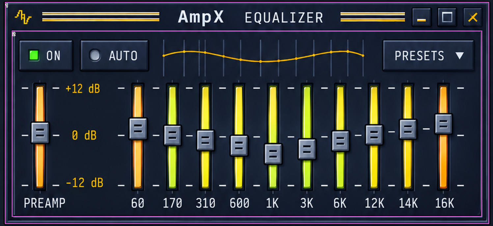
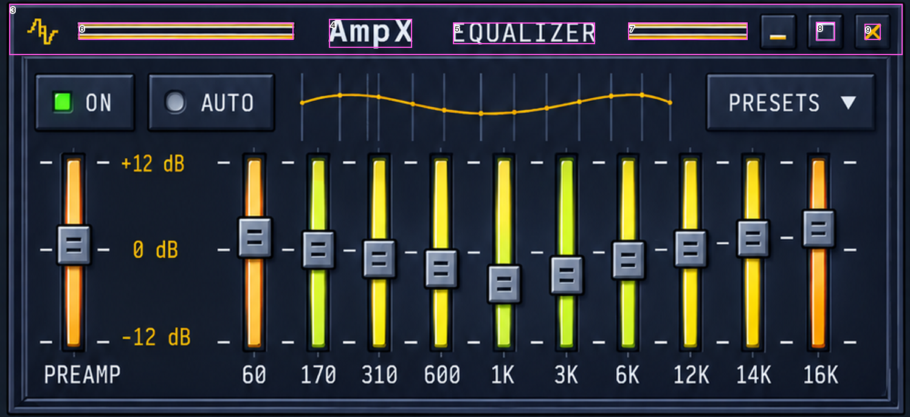
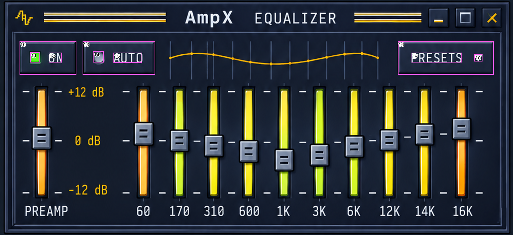
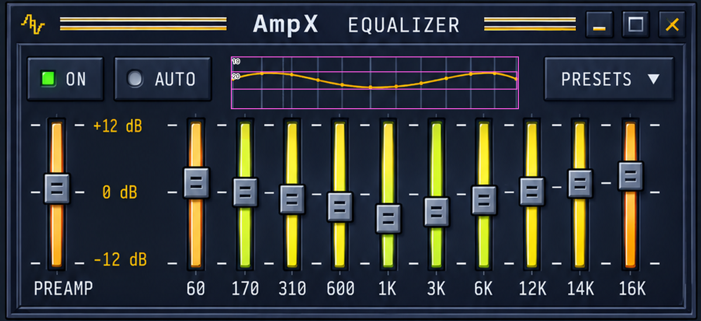
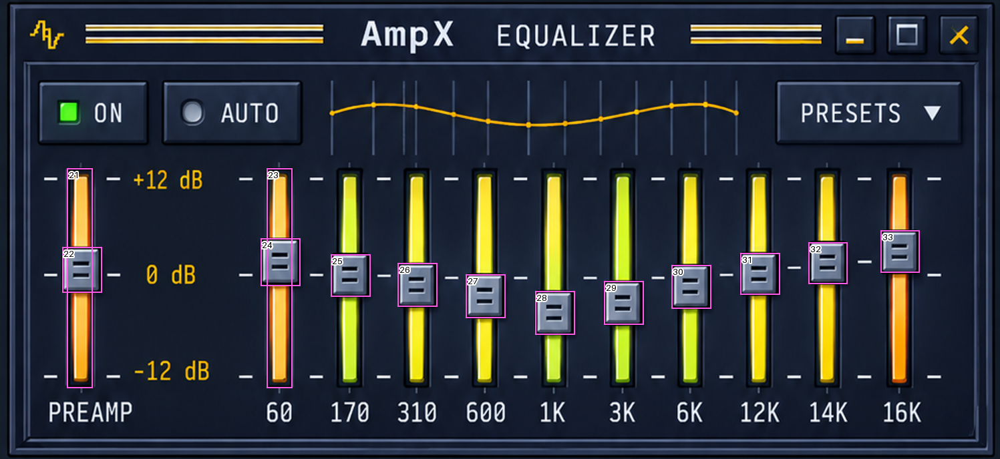
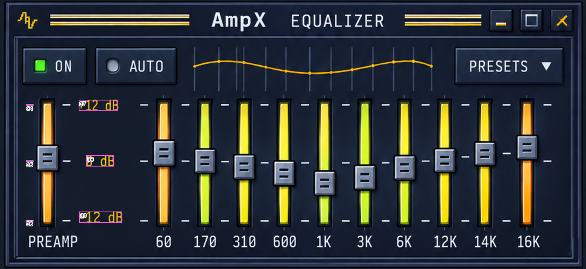
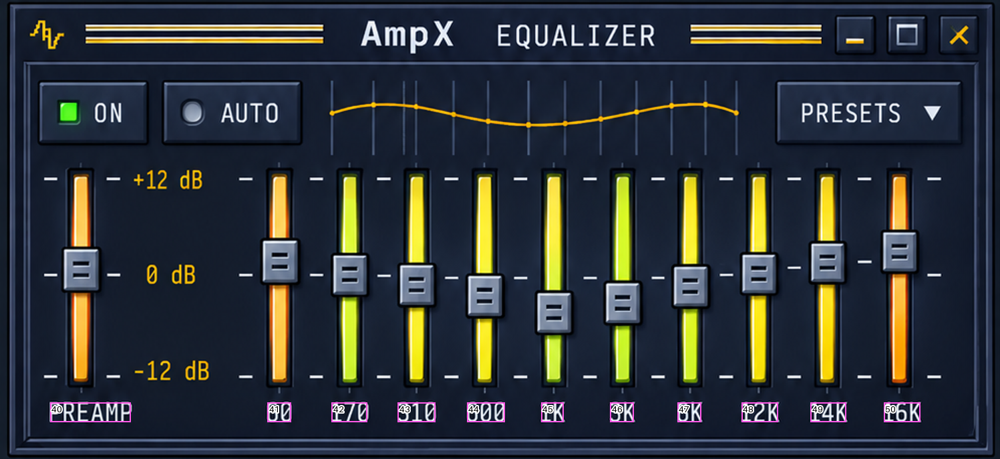

# ReferenceMeasurementsV2 — Equalizer

Generated by `scripts/measure_reference.py --module eq`. Source SHA-256: `1db8d6c6f70f98a2b25d413dd3f4129283ebc917ccacdab9855de585d5c7b2a2`.

**Origins:** module `(10,466)` px; content `(10,523)` px (shared 28.5 pt header). Panel `980×451` px = `490×225.5` pt; gap to Player 12 px = 6 pt.

| ID | Element | Source x,y,w,h (px) | Module x,y,w,h (pt) | Content x,y,w,h (pt) |
|---|---|---|---|---|
| 1 | `panel` | [10, 466, 980, 451] | [0.0, 0.0, 490.0, 225.5] | [0.0, -28.5, 490.0, 225.5] |
| 2 | `content.frame` | [24, 524, 952, 378] | [7.0, 29.0, 476.0, 189.0] | [7.0, 0.5, 476.0, 189.0] |
| 3 | `header` | [10, 466, 980, 57] | [0.0, 0.0, 490.0, 28.5] | [0.0, -28.5, 490.0, 28.5] |
| 4 | `header.brand` | [361, 483, 91, 32] | [175.5, 8.5, 45.5, 16.0] | [175.5, -20.0, 45.5, 16.0] |
| 5 | `header.title` | [497, 487, 156, 24] | [243.5, 10.5, 78.0, 12.0] | [243.5, -18.0, 78.0, 12.0] |
| 6 | `header.leftRule` | [86, 487, 236, 19] | [38.0, 10.5, 118.0, 9.5] | [38.0, -18.0, 118.0, 9.5] |
| 7 | `header.rightRule` | [689, 487, 131, 19] | [339.5, 10.5, 65.5, 9.5] | [339.5, -18.0, 65.5, 9.5] |
| 8 | `header.collapseGlyph` | [895, 486, 21, 21] | [442.5, 10.0, 10.5, 10.5] | [442.5, -18.5, 10.5, 10.5] |
| 9 | `header.closeGlyph` | [948, 488, 18, 18] | [469.0, 11.0, 9.0, 9.0] | [469.0, -17.5, 9.0, 9.0] |
| 10 | `toggle.on` | [38, 542, 111, 66] | [14.0, 38.0, 55.5, 33.0] | [14.0, 9.5, 55.5, 33.0] |
| 11 | `toggle.on.indicator` | [59, 564, 19, 20] | [24.5, 49.0, 9.5, 10.0] | [24.5, 20.5, 9.5, 10.0] |
| 12 | `toggle.on.label` | [95, 565, 26, 19] | [42.5, 49.5, 13.0, 9.5] | [42.5, 21.0, 13.0, 9.5] |
| 13 | `toggle.auto` | [161, 542, 141, 66] | [75.5, 38.0, 70.5, 33.0] | [75.5, 9.5, 70.5, 33.0] |
| 14 | `toggle.auto.indicator` | [181, 562, 21, 22] | [85.5, 48.0, 10.5, 11.0] | [85.5, 19.5, 10.5, 11.0] |
| 15 | `toggle.auto.label` | [221, 565, 56, 20] | [105.5, 49.5, 28.0, 10.0] | [105.5, 21.0, 28.0, 10.0] |
| 16 | `presets` | [774, 542, 187, 66] | [382.0, 38.0, 93.5, 33.0] | [382.0, 9.5, 93.5, 33.0] |
| 17 | `presets.label` | [801, 565, 97, 19] | [395.5, 49.5, 48.5, 9.5] | [395.5, 21.0, 48.5, 9.5] |
| 18 | `presets.triangle` | [923, 568, 16, 14] | [456.5, 51.0, 8.0, 7.0] | [456.5, 22.5, 8.0, 7.0] |
| 19 | `curve.gridAndKnots` | [329, 543, 410, 75] | [159.5, 38.5, 205.0, 37.5] | [159.5, 10.0, 205.0, 37.5] |
| 20 | `curve.ink` | [329, 564, 408, 26] | [159.5, 49.0, 204.0, 13.0] | [159.5, 20.5, 204.0, 13.0] |
| 21 | `preamp.slot` | [67, 630, 26, 220] | [28.5, 82.0, 13.0, 110.0] | [28.5, 53.5, 13.0, 110.0] |
| 22 | `preamp.thumb` | [62, 709, 40, 46] | [26.0, 121.5, 20.0, 23.0] | [26.0, 93.0, 20.0, 23.0] |
| 23 | `band60.slot` | [266, 630, 26, 220] | [128.0, 82.0, 13.0, 110.0] | [128.0, 53.5, 13.0, 110.0] |
| 24 | `band60.thumb` | [260, 700, 40, 48] | [125.0, 117.0, 20.0, 24.0] | [125.0, 88.5, 20.0, 24.0] |
| 25 | `band170.thumb` | [330, 716, 40, 43] | [160.0, 125.0, 20.0, 21.5] | [160.0, 96.5, 20.0, 21.5] |
| 26 | `band310.thumb` | [397, 725, 40, 44] | [193.5, 129.5, 20.0, 22.0] | [193.5, 101.0, 20.0, 22.0] |
| 27 | `band600.thumb` | [465, 736, 40, 44] | [227.5, 135.0, 20.0, 22.0] | [227.5, 106.5, 20.0, 22.0] |
| 28 | `band1K.thumb` | [534, 753, 40, 44] | [262.0, 143.5, 20.0, 22.0] | [262.0, 115.0, 20.0, 22.0] |
| 29 | `band3K.thumb` | [603, 743, 40, 44] | [296.5, 138.5, 20.0, 22.0] | [296.5, 110.0, 20.0, 22.0] |
| 30 | `band6K.thumb` | [670, 727, 40, 44] | [330.0, 130.5, 20.0, 22.0] | [330.0, 102.0, 20.0, 22.0] |
| 31 | `band12K.thumb` | [739, 715, 40, 42] | [364.5, 124.5, 20.0, 21.0] | [364.5, 96.0, 20.0, 21.0] |
| 32 | `band14K.thumb` | [807, 704, 39, 42] | [398.5, 119.0, 19.5, 21.0] | [398.5, 90.5, 19.5, 21.0] |
| 33 | `band16K.thumb` | [879, 692, 39, 43] | [434.5, 113.0, 19.5, 21.5] | [434.5, 84.5, 19.5, 21.5] |
| 34 | `tick.plus12.preamp` | [44, 640, 13, 2] | [17.0, 87.0, 6.5, 1.0] | [17.0, 58.5, 6.5, 1.0] |
| 35 | `tick.zero.preamp` | [44, 736, 13, 2] | [17.0, 135.0, 6.5, 1.0] | [17.0, 106.5, 6.5, 1.0] |
| 36 | `tick.minus12.preamp` | [44, 837, 13, 3] | [17.0, 185.5, 6.5, 1.5] | [17.0, 157.0, 6.5, 1.5] |
| 37 | `db.plus12` | [134, 632, 67, 19] | [62.0, 83.0, 33.5, 9.5] | [62.0, 54.5, 33.5, 9.5] |
| 38 | `db.zero` | [147, 727, 47, 19] | [68.5, 130.5, 23.5, 9.5] | [68.5, 102.0, 23.5, 9.5] |
| 39 | `db.minus12` | [135, 823, 73, 19] | [62.5, 178.5, 36.5, 9.5] | [62.5, 150.0, 36.5, 9.5] |
| 40 | `label.preamp` | [50, 864, 81, 20] | [20.0, 199.0, 40.5, 10.0] | [20.0, 170.5, 40.5, 10.0] |
| 41 | `label.60` | [267, 864, 24, 20] | [128.5, 199.0, 12.0, 10.0] | [128.5, 170.5, 12.0, 10.0] |
| 42 | `label.170` | [331, 864, 36, 20] | [160.5, 199.0, 18.0, 10.0] | [160.5, 170.5, 18.0, 10.0] |
| 43 | `label.310` | [397, 864, 38, 20] | [193.5, 199.0, 19.0, 10.0] | [193.5, 170.5, 19.0, 10.0] |
| 44 | `label.600` | [466, 864, 38, 20] | [228.0, 199.0, 19.0, 10.0] | [228.0, 170.5, 19.0, 10.0] |
| 45 | `label.1K` | [540, 864, 23, 20] | [265.0, 199.0, 11.5, 10.0] | [265.0, 170.5, 11.5, 10.0] |
| 46 | `label.3K` | [609, 864, 24, 20] | [299.5, 199.0, 12.0, 10.0] | [299.5, 170.5, 12.0, 10.0] |
| 47 | `label.6K` | [676, 864, 24, 20] | [333.0, 199.0, 12.0, 10.0] | [333.0, 170.5, 12.0, 10.0] |
| 48 | `label.12K` | [740, 864, 37, 20] | [365.0, 199.0, 18.5, 10.0] | [365.0, 170.5, 18.5, 10.0] |
| 49 | `label.14K` | [809, 864, 36, 20] | [399.5, 199.0, 18.0, 10.0] | [399.5, 170.5, 18.0, 10.0] |
| 50 | `label.16K` | [882, 864, 37, 20] | [436.0, 199.0, 18.5, 10.0] | [436.0, 170.5, 18.5, 10.0] |

## Annotated checks

### Frame

### Header

### Toprow

### Curve

### Sliders

### Scale

### Labels

## Derived reference values

Thumb travel: +12 dB center at content y 58.5 and −12 dB at 157.25 (measured tick rows); 0 dB at the midpoint 107.875. Values below are display-only fixture values derived from thumb centers.

| Slider | Thumb center y (pt) | dB |
|---|---|---|
| preamp | 104.5 | 0.82 |
| band60 | 100.5 | 1.79 |
| band170 | 107.25 | 0.15 |
| band310 | 112.0 | -1.0 |
| band600 | 117.5 | -2.34 |
| band1K | 126.0 | -4.41 |
| band3K | 121.0 | -3.19 |
| band6K | 113.0 | -1.25 |
| band12K | 106.5 | 0.33 |
| band14K | 101.0 | 1.67 |
| band16K | 95.25 | 3.07 |

## Observations and non-observable properties

- No curve well: the response curve is drawn on the panel over thin vertical grid lines (content y 10–47) with gold knot dots. Knots: edges at x 161/362 and bands from 181 to 346.5 (18.39 pt pitch). A 13th grid line at x 196 does not correspond to a knot.
- The drawn curve is not consistent with the thumb values (e.g. 60 Hz thumb +1.5 dB while its knot rises ~4 pt). Rendering derives the curve from values; shape differences are expected.
- Track color varies by band value (green below 0 dB, yellow near 0, amber/orange above) with a vertical tint, but not as a single consistent function.
- Band thumb centers are unevenly spaced (67–72 px); measured per-band centers are used. The 0 dB tick rows near some thumbs are displaced in the reference.
- Header elements sit 0.5–1.5 pt lower than the Player header (rules +1, frame top +1.5); the shared header geometry is retained.
- Reference EQ header shows three buttons; the spec defines two (collapse, close) for non-Player modules.
