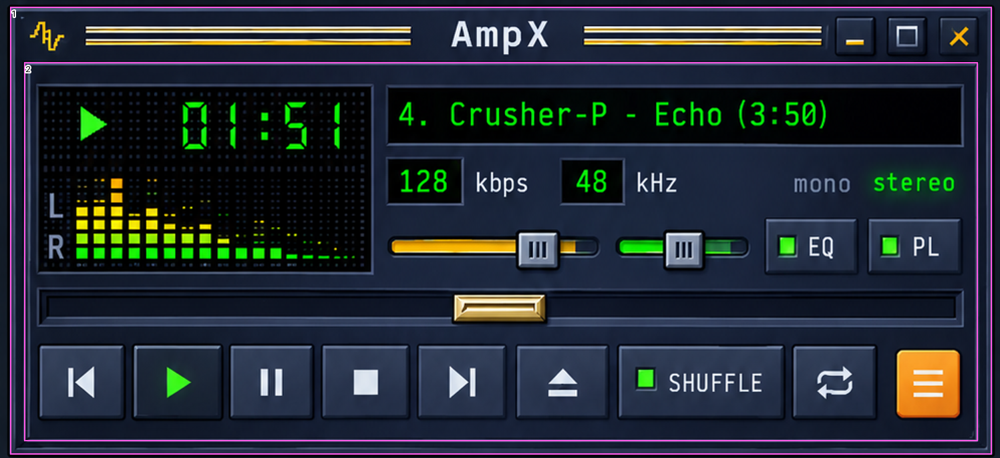
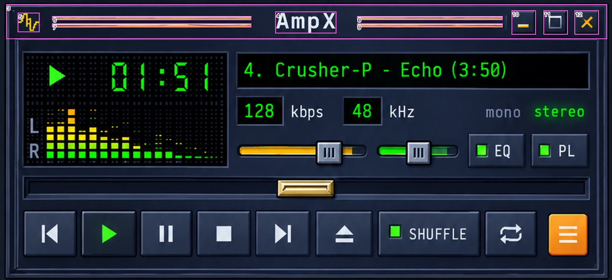
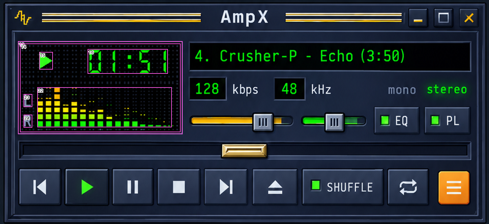
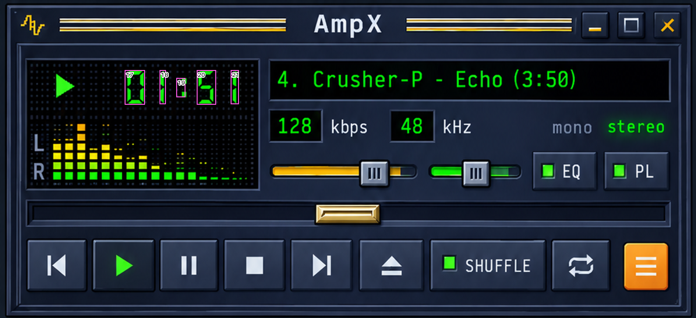
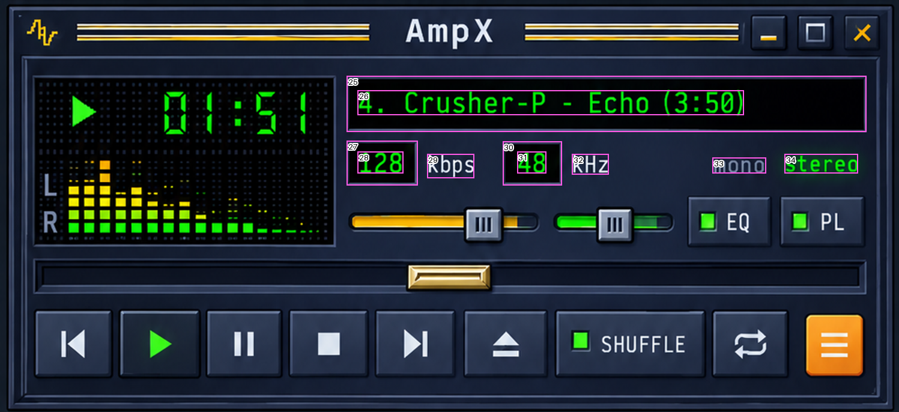
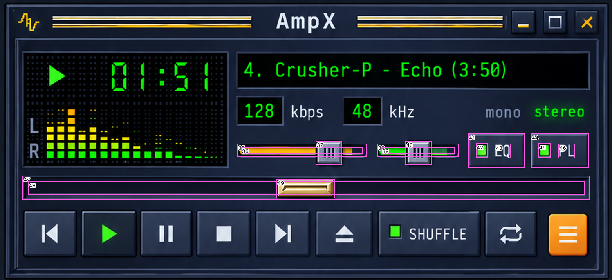
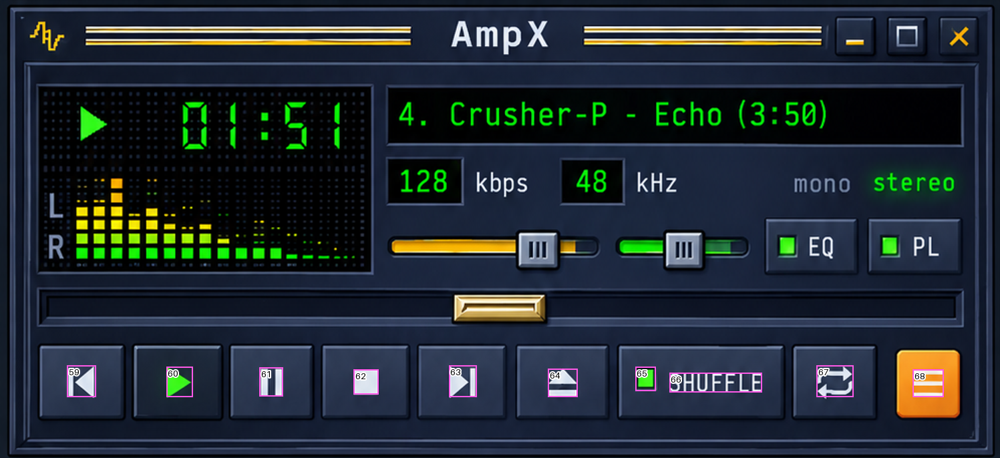
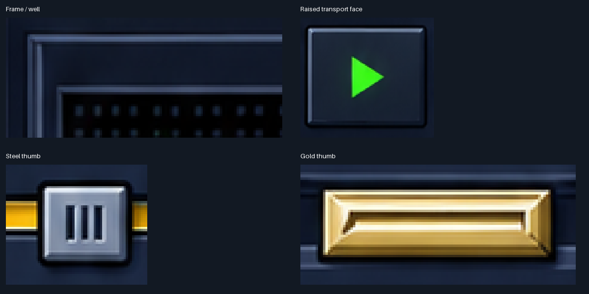
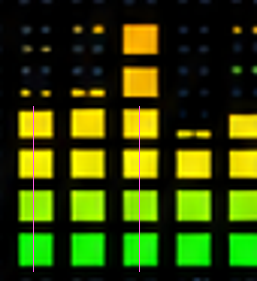

# ReferenceMeasurementsV2 — Player

Generated by `scripts/measure_reference.py`. Source SHA-256: `1db8d6c6f70f98a2b25d413dd3f4129283ebc917ccacdab9855de585d5c7b2a2`.

**Scope:** Player only. Manually measured artwork bounds, ±2 source-pixel edge uncertainty (±1 pt); right/bottom exclusive. Glyph bounds are visible ink, not font layout cells. Hit areas are not visible in the PNG.

**Origins:** module `(10,7)` px; content `(10,64)` px. Player crop `980×447` px = `490×223.5` pt. Header convention `28.5` pt; the content-frame highlight begins at y=62, two pixels above that origin. Replaces the V1 inferred y=22 canvas top and 22 pt header.

## Measured rectangles

| ID | Element | Source x,y,w,h (px) | Module x,y,w,h (pt) | Content x,y,w,h (pt) |
|---|---|---|---|---|
| 1 | `panel` | [10, 7, 980, 447] | [0.0, 0.0, 490.0, 223.5] | [0.0, -28.5, 490.0, 223.5] |
| 2 | `content.frame` | [24, 62, 952, 379] | [7.0, 27.5, 476.0, 189.5] | [7.0, -1.0, 476.0, 189.5] |
| 3 | `header` | [10, 7, 980, 57] | [0.0, 0.0, 490.0, 28.5] | [0.0, -28.5, 490.0, 28.5] |
| 4 | `header.brand` | [449, 19, 100, 36] | [219.5, 6.0, 50.0, 18.0] | [219.5, -22.5, 50.0, 18.0] |
| 5 | `header.gripGlyph` | [29, 21, 36, 32] | [9.5, 7.0, 18.0, 16.0] | [9.5, -21.5, 18.0, 16.0] |
| 6 | `header.leftLine.top` | [85, 26, 325, 7] | [37.5, 9.5, 162.5, 3.5] | [37.5, -19.0, 162.5, 3.5] |
| 7 | `header.leftLine.bottom` | [85, 38, 325, 7] | [37.5, 15.5, 162.5, 3.5] | [37.5, -13.0, 162.5, 3.5] |
| 8 | `header.rightLine.top` | [582, 26, 238, 7] | [286.0, 9.5, 119.0, 3.5] | [286.0, -19.0, 119.0, 3.5] |
| 9 | `header.rightLine.bottom` | [582, 38, 238, 7] | [286.0, 15.5, 119.0, 3.5] | [286.0, -13.0, 119.0, 3.5] |
| 10 | `header.minimize` | [834, 17, 40, 40] | [412.0, 5.0, 20.0, 20.0] | [412.0, -23.5, 20.0, 20.0] |
| 11 | `header.collapse` | [886, 17, 40, 40] | [438.0, 5.0, 20.0, 20.0] | [438.0, -23.5, 20.0, 20.0] |
| 12 | `header.close` | [937, 17, 40, 40] | [463.5, 5.0, 20.0, 20.0] | [463.5, -23.5, 20.0, 20.0] |
| 13 | `display.well` | [37, 84, 336, 190] | [13.5, 38.5, 168.0, 95.0] | [13.5, 10.0, 168.0, 95.0] |
| 14 | `display.blackInterior` | [41, 89, 328, 181] | [15.5, 41.0, 164.0, 90.5] | [15.5, 12.5, 164.0, 90.5] |
| 15 | `display.playGlyph` | [80, 106, 28, 36] | [35.0, 49.5, 14.0, 18.0] | [35.0, 21.0, 14.0, 18.0] |
| 16 | `display.timer` | [179, 100, 164, 51] | [84.5, 46.5, 82.0, 25.5] | [84.5, 18.0, 82.0, 25.5] |
| 17 | `display.timer.digit0` | [179, 101, 29, 50] | [84.5, 47.0, 14.5, 25.0] | [84.5, 18.5, 14.5, 25.0] |
| 18 | `display.timer.digit1` | [229, 101, 9, 49] | [109.5, 47.0, 4.5, 24.5] | [109.5, 18.5, 4.5, 24.5] |
| 19 | `display.timer.colon` | [253, 112, 13, 28] | [121.5, 52.5, 6.5, 14.0] | [121.5, 24.0, 6.5, 14.0] |
| 20 | `display.timer.digit5` | [282, 101, 28, 50] | [136.0, 47.0, 14.0, 25.0] | [136.0, 18.5, 14.0, 25.0] |
| 21 | `display.timer.last1` | [331, 101, 12, 49] | [160.5, 47.0, 6.0, 24.5] | [160.5, 18.5, 6.0, 24.5] |
| 22 | `display.spectrum` | [76, 178, 275, 82] | [33.0, 85.5, 137.5, 41.0] | [33.0, 57.0, 137.5, 41.0] |
| 23 | `display.channelL` | [48, 192, 18, 27] | [19.0, 92.5, 9.0, 13.5] | [19.0, 64.0, 9.0, 13.5] |
| 24 | `display.channelR` | [48, 234, 18, 27] | [19.0, 113.5, 9.0, 13.5] | [19.0, 85.0, 9.0, 13.5] |
| 25 | `track.well` | [385, 84, 577, 63] | [187.5, 38.5, 288.5, 31.5] | [187.5, 10.0, 288.5, 31.5] |
| 26 | `track.text` | [397, 100, 429, 28] | [193.5, 46.5, 214.5, 14.0] | [193.5, 18.0, 214.5, 14.0] |
| 27 | `metadata.bitrateWell` | [385, 156, 79, 50] | [187.5, 74.5, 39.5, 25.0] | [187.5, 46.0, 39.5, 25.0] |
| 28 | `metadata.bitrateInk` | [397, 168, 51, 25] | [193.5, 80.5, 25.5, 12.5] | [193.5, 52.0, 25.5, 12.5] |
| 29 | `metadata.kbps` | [474, 171, 53, 27] | [232.0, 82.0, 26.5, 13.5] | [232.0, 53.5, 26.5, 13.5] |
| 30 | `metadata.sampleRateWell` | [558, 157, 66, 49] | [274.0, 75.0, 33.0, 24.5] | [274.0, 46.5, 33.0, 24.5] |
| 31 | `metadata.sampleRateInk` | [574, 168, 33, 25] | [282.0, 80.5, 16.5, 12.5] | [282.0, 52.0, 16.5, 12.5] |
| 32 | `metadata.kHz` | [635, 171, 41, 23] | [312.5, 82.0, 20.5, 11.5] | [312.5, 53.5, 20.5, 11.5] |
| 33 | `metadata.mono` | [791, 175, 60, 18] | [390.5, 84.0, 30.0, 9.0] | [390.5, 55.5, 30.0, 9.0] |
| 34 | `metadata.stereo` | [871, 171, 82, 22] | [430.5, 82.0, 41.0, 11.0] | [430.5, 53.5, 41.0, 11.0] |
| 35 | `volume.track` | [387, 235, 211, 22] | [188.5, 114.0, 105.5, 11.0] | [188.5, 85.5, 105.5, 11.0] |
| 36 | `volume.coloredInterior` | [393, 240, 199, 12] | [191.5, 116.5, 99.5, 6.0] | [191.5, 88.0, 99.5, 6.0] |
| 37 | `volume.thumb` | [515, 230, 43, 40] | [252.5, 111.5, 21.5, 20.0] | [252.5, 83.0, 21.5, 20.0] |
| 38 | `balance.track` | [615, 235, 134, 22] | [302.5, 114.0, 67.0, 11.0] | [302.5, 85.5, 67.0, 11.0] |
| 39 | `balance.coloredInterior` | [622, 240, 120, 12] | [306.0, 116.5, 60.0, 6.0] | [306.0, 88.0, 60.0, 6.0] |
| 40 | `balance.thumb` | [661, 230, 43, 40] | [325.5, 111.5, 21.5, 20.0] | [325.5, 83.0, 21.5, 20.0] |
| 41 | `toggle.eq` | [763, 218, 93, 57] | [376.5, 105.5, 46.5, 28.5] | [376.5, 77.0, 46.5, 28.5] |
| 42 | `toggle.eq.indicator` | [776, 234, 20, 24] | [383.0, 113.5, 10.0, 12.0] | [383.0, 85.0, 10.0, 12.0] |
| 43 | `toggle.eq.label` | [807, 235, 26, 24] | [398.5, 114.0, 13.0, 12.0] | [398.5, 85.5, 13.0, 12.0] |
| 44 | `toggle.pl` | [866, 218, 95, 57] | [428.0, 105.5, 47.5, 28.5] | [428.0, 77.0, 47.5, 28.5] |
| 45 | `toggle.pl.indicator` | [878, 234, 21, 24] | [434.0, 113.5, 10.5, 12.0] | [434.0, 85.0, 10.5, 12.0] |
| 46 | `toggle.pl.label` | [911, 235, 27, 24] | [450.5, 114.0, 13.5, 12.0] | [450.5, 85.5, 13.5, 12.0] |
| 47 | `position.well` | [37, 287, 925, 39] | [13.5, 140.0, 462.5, 19.5] | [13.5, 111.5, 462.5, 19.5] |
| 48 | `position.trackInterior` | [46, 296, 908, 22] | [18.0, 144.5, 454.0, 11.0] | [18.0, 116.0, 454.0, 11.0] |
| 49 | `position.thumb` | [451, 292, 95, 32] | [220.5, 142.5, 47.5, 16.0] | [220.5, 114.0, 47.5, 16.0] |
| 50 | `transport.previous` | [38, 343, 88, 77] | [14.0, 168.0, 44.0, 38.5] | [14.0, 139.5, 44.0, 38.5] |
| 51 | `transport.play` | [132, 343, 92, 77] | [61.0, 168.0, 46.0, 38.5] | [61.0, 139.5, 46.0, 38.5] |
| 52 | `transport.pause` | [229, 343, 84, 77] | [109.5, 168.0, 42.0, 38.5] | [109.5, 139.5, 42.0, 38.5] |
| 53 | `transport.stop` | [321, 343, 87, 77] | [155.5, 168.0, 43.5, 38.5] | [155.5, 139.5, 43.5, 38.5] |
| 54 | `transport.next` | [417, 343, 87, 77] | [203.5, 168.0, 43.5, 38.5] | [203.5, 139.5, 43.5, 38.5] |
| 55 | `transport.eject` | [515, 343, 94, 77] | [252.5, 168.0, 47.0, 38.5] | [252.5, 139.5, 47.0, 38.5] |
| 56 | `transport.shuffle` | [617, 343, 168, 77] | [303.5, 168.0, 84.0, 38.5] | [303.5, 139.5, 84.0, 38.5] |
| 57 | `transport.repeat` | [791, 343, 85, 77] | [390.5, 168.0, 42.5, 38.5] | [390.5, 139.5, 42.5, 38.5] |
| 58 | `transport.menu` | [893, 348, 67, 71] | [441.5, 170.5, 33.5, 35.5] | [441.5, 142.0, 33.5, 35.5] |
| 59 | `transport.previous.glyph` | [67, 365, 29, 32] | [28.5, 179.0, 14.5, 16.0] | [28.5, 150.5, 14.5, 16.0] |
| 60 | `transport.play.glyph` | [166, 366, 27, 31] | [78.0, 179.5, 13.5, 15.5] | [78.0, 151.0, 13.5, 15.5] |
| 61 | `transport.pause.glyph` | [259, 367, 24, 29] | [124.5, 180.0, 12.0, 14.5] | [124.5, 151.5, 12.0, 14.5] |
| 62 | `transport.stop.glyph` | [353, 369, 25, 25] | [171.5, 181.0, 12.5, 12.5] | [171.5, 152.5, 12.5, 12.5] |
| 63 | `transport.next.glyph` | [448, 365, 28, 32] | [219.0, 179.0, 14.0, 16.0] | [219.0, 150.5, 14.0, 16.0] |
| 64 | `transport.eject.glyph` | [547, 368, 30, 29] | [268.5, 180.5, 15.0, 14.5] | [268.5, 152.0, 15.0, 14.5] |
| 65 | `transport.shuffle.indicator` | [634, 366, 21, 25] | [312.0, 179.5, 10.5, 12.5] | [312.0, 151.0, 10.5, 12.5] |
| 66 | `transport.shuffle.label` | [668, 372, 93, 20] | [329.0, 182.5, 46.5, 10.0] | [329.0, 154.0, 46.5, 10.0] |
| 67 | `transport.repeat.glyph` | [815, 365, 37, 32] | [402.5, 179.0, 18.5, 16.0] | [402.5, 150.5, 18.5, 16.0] |
| 68 | `transport.menu.glyph` | [911, 369, 31, 28] | [450.5, 181.0, 15.5, 14.0] | [450.5, 152.5, 15.5, 14.0] |

## Annotated checks

### Frame



### Header



### Display



### Timer



### Metadata



### Sliders



### Transport


### Glyphs



## Material samples

Patch medians are observations, not a uniform replacement palette. The reference has gradients, glow and multiple edge layers. Preserve these variations; coordinates allow verification.

| Layer | Source patch | RGB | Hex |
|---|---|---|---|
| display.black | [51, 152, 5, 5] | [3, 5, 7] | `#030507` |
| panel.interior | [700, 210, 5, 5] | [27, 38, 62] | `#1B263E` |
| button.face | [145, 352, 5, 5] | [30, 40, 58] | `#1E283A` |
| button.topHighlight | [142, 346, 10, 1] | [113, 132, 162] | `#7184A2` |
| button.leftHighlight | [135, 355, 1, 10] | [98, 113, 139] | `#62718B` |
| button.bottomShadow | [145, 416, 10, 1] | [15, 25, 40] | `#0F1928` |
| frame.highlight | [50, 64, 10, 1] | [71, 87, 118] | `#475776` |
| frame.darkEdge | [50, 66, 10, 1] | [13, 20, 34] | `#0D1422` |
| thumb.steelFace | [522, 237, 5, 5] | [131, 145, 170] | `#8391AA` |
| thumb.steelHighlight | [522, 233, 10, 1] | [235, 242, 248] | `#EBF2F8` |
| thumb.goldFace | [475, 312, 10, 3] | [197, 163, 81] | `#C5A351` |
| thumb.goldHighlight | [467, 295, 20, 1] | [255, 255, 211] | `#FFFFD3` |



The JSON `edgeProfiles` contains per-source-pixel RGB scans through frame, well, button and thumb edges. Each sample is 0.5 logical pt; preserve the sequence of highlight, face and shadow layers rather than replacing it with a one-line outline. The enlarged crops use nearest-neighbor scaling to expose source pixels.


## Spectrum scan

```json
{
  "sourceRuns": {
    "81": [
      [
        207,
        8
      ],
      [
        220,
        9
      ],
      [
        233,
        10
      ],
      [
        247,
        11
      ]
    ],
    "99": [
      [
        206,
        9
      ],
      [
        220,
        9
      ],
      [
        233,
        10
      ],
      [
        247,
        11
      ]
    ],
    "116": [
      [
        206,
        10
      ],
      [
        220,
        9
      ],
      [
        233,
        10
      ],
      [
        247,
        11
      ]
    ],
    "134": [
      [
        220,
        9
      ],
      [
        233,
        10
      ],
      [
        247,
        11
      ]
    ]
  },
  "medianLitHeightSourcePx": 10,
  "medianGapSourcePx": 4,
  "note": "Thresholded bright cores at y=205..259; glow excluded. No fallback or canonical override."
}
```



## Non-observable properties and implementation constraints

- Thumb travel and invisible hit bounds cannot be measured from one pose. JSON records a derived inset-travel proposal separately. Validate it during control implementation; do not present it as extracted geometry.
- Font point size, baseline metrics and hidden timer cell widths cannot be uniquely recovered from raster ink. Fit bundled fonts and stable digit cells to measured ink, then verify rendered overlays before freezing metrics. The visible `1` is narrow ink, not a narrower layout cell.
- Keep centered Player branding; single-line track/metadata; distinct kbps, kHz, mono, stereo; EQ/PL and Shuffle optically aligned with indicators. The timer reads `01:51` and must retain its proportions for other values.
- Header source order is left decoration, centered brand between paired lines, then minimize/collapse/close; behavior comes from the spec.

## V1 corrections

- Panel top is measured directly, not inferred by centering a total composition height.
- Metadata includes channel labels separately from the two numeric wells.
- The play triangle is outside the timer ink rectangle.
- Volume/balance thumbs exceed the narrow track height. Position includes a recessed well and broad gold handle, not a four-point-high entire control.
- Transport faces have individual widths; Shuffle is 84 pt wide rather than a uniform 44 pt.
- Spectrum raw runs are retained without the unapproved 3 pt override.
- EQ/Playlist V1 values remain unvalidated by this Player-only step.
