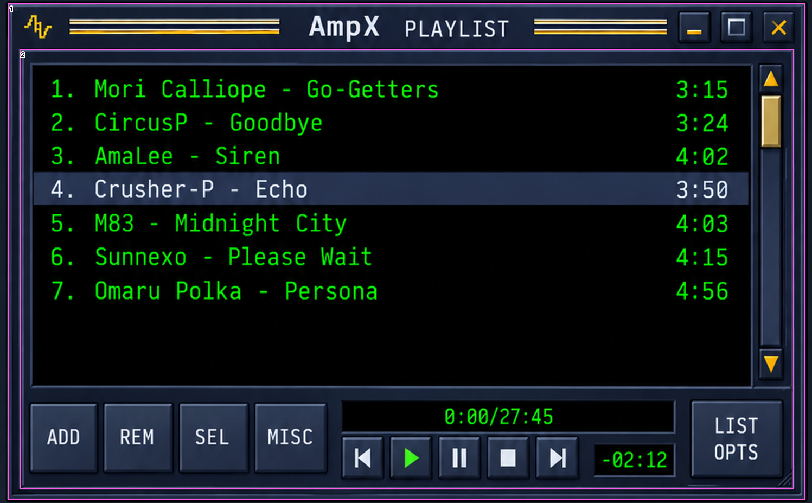
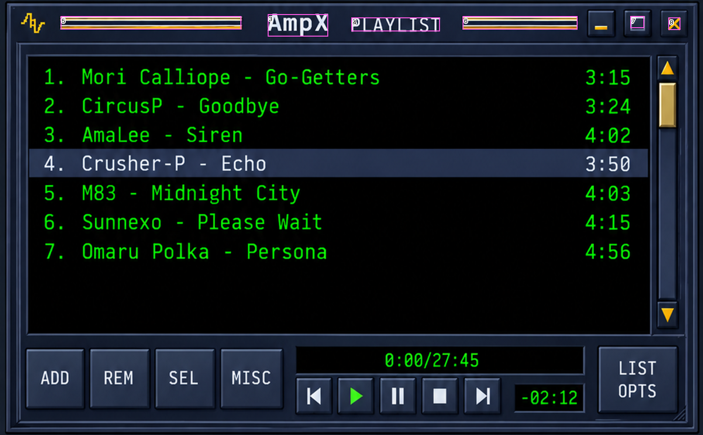
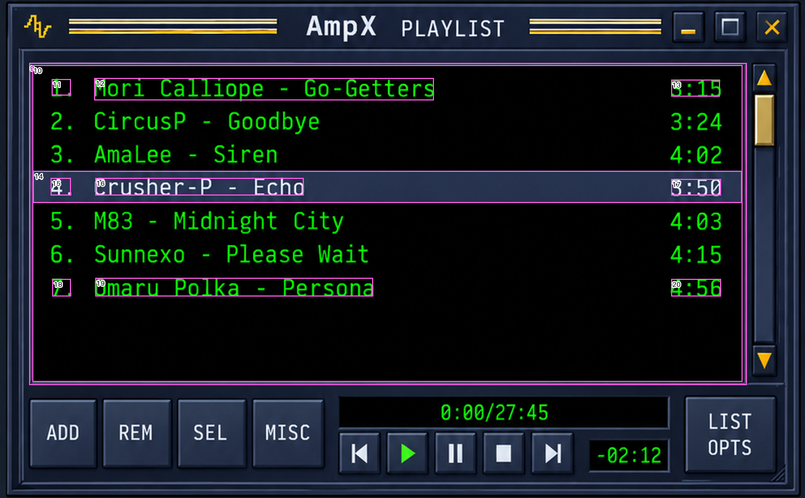
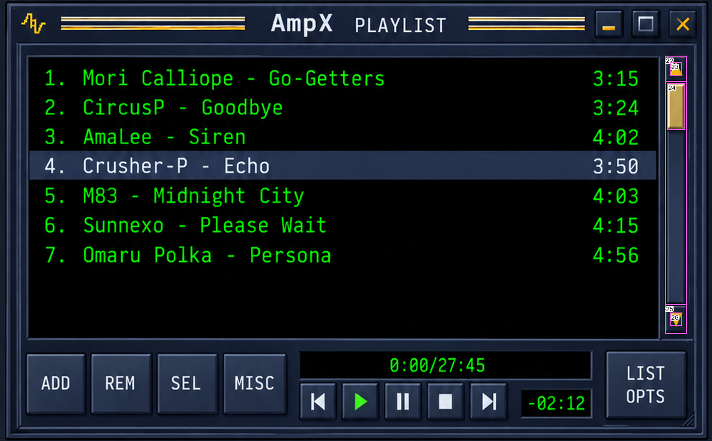
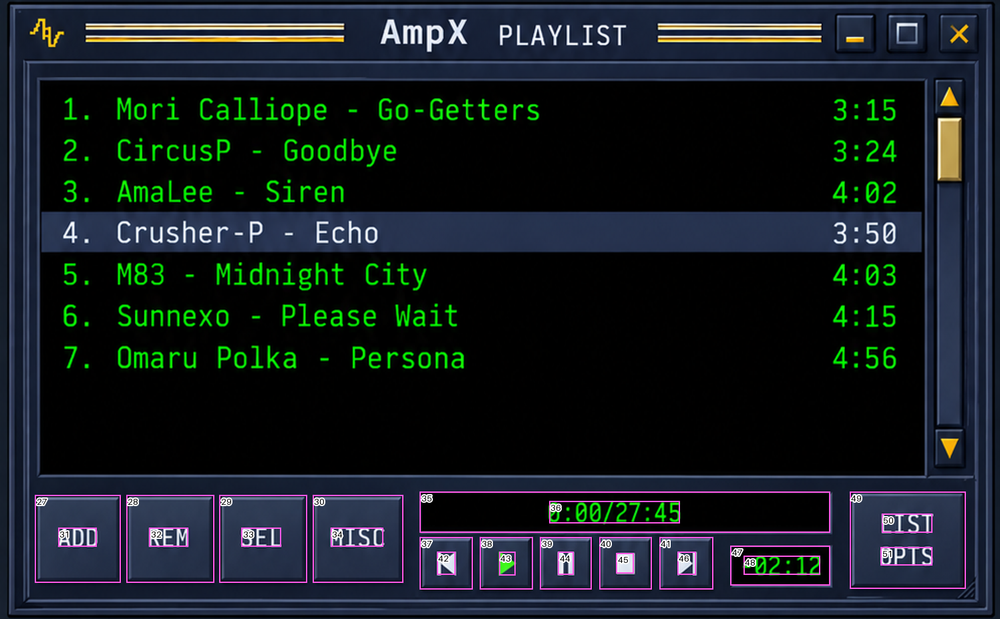

# ReferenceMeasurementsV2 — Playlist

Generated by `scripts/measure_reference.py --module playlist`. Source SHA-256: `1db8d6c6f70f98a2b25d413dd3f4129283ebc917ccacdab9855de585d5c7b2a2`.

**Origins:** module `(10,930)` px; content `(10,987)` px (shared 28.5 pt header). Panel `980×610` px = `490×305` pt. The gap above is 13 px (6.5 pt) against the 6 pt layout gap.

| ID | Element | Source x,y,w,h (px) | Module x,y,w,h (pt) | Content x,y,w,h (pt) |
|---|---|---|---|---|
| 1 | `panel` | [10, 930, 980, 610] | [0.0, 0.0, 490.0, 305.0] | [0.0, -28.5, 490.0, 305.0] |
| 2 | `content.frame` | [24, 986, 952, 541] | [7.0, 28.0, 476.0, 270.5] | [7.0, -0.5, 476.0, 270.5] |
| 3 | `header.brand` | [380, 946, 86, 32] | [185.0, 8.0, 43.0, 16.0] | [185.0, -20.5, 43.0, 16.0] |
| 4 | `header.title` | [499, 951, 126, 20] | [244.5, 10.5, 63.0, 10.0] | [244.5, -18.0, 63.0, 10.0] |
| 5 | `header.leftRule` | [86, 949, 257, 19] | [38.0, 9.5, 128.5, 9.5] | [38.0, -19.0, 128.5, 9.5] |
| 6 | `header.rightRule` | [657, 949, 163, 19] | [323.5, 9.5, 81.5, 9.5] | [323.5, -19.0, 81.5, 9.5] |
| 7 | `header.collapseGlyph` | [895, 949, 20, 17] | [442.5, 9.5, 10.0, 8.5] | [442.5, -19.0, 10.0, 8.5] |
| 8 | `header.closeGlyph` | [949, 951, 17, 18] | [469.5, 10.5, 8.5, 9.0] | [469.5, -18.0, 8.5, 9.0] |
| 9 | `rows.well` | [36, 1004, 890, 400] | [13.0, 37.0, 445.0, 200.0] | [13.0, 8.5, 445.0, 200.0] |
| 10 | `rows.interior` | [40, 1007, 881, 393] | [15.0, 38.5, 440.5, 196.5] | [15.0, 10.0, 440.5, 196.5] |
| 11 | `row1.number` | [64, 1024, 24, 21] | [27.0, 47.0, 12.0, 10.5] | [27.0, 18.5, 12.0, 10.5] |
| 12 | `row1.title` | [117, 1023, 421, 28] | [53.5, 46.5, 210.5, 14.0] | [53.5, 18.0, 210.5, 14.0] |
| 13 | `row1.duration` | [832, 1025, 61, 21] | [411.0, 47.5, 30.5, 10.5] | [411.0, 19.0, 30.5, 10.5] |
| 14 | `row4.selection` | [41, 1138, 879, 40] | [15.5, 104.0, 439.5, 20.0] | [15.5, 75.5, 439.5, 20.0] |
| 15 | `row4.number` | [63, 1147, 25, 22] | [26.5, 108.5, 12.5, 11.0] | [26.5, 80.0, 12.5, 11.0] |
| 16 | `row4.title` | [118, 1147, 259, 22] | [54.0, 108.5, 129.5, 11.0] | [54.0, 80.0, 129.5, 11.0] |
| 17 | `row4.duration` | [832, 1148, 62, 21] | [411.0, 109.0, 31.0, 10.5] | [411.0, 80.5, 31.0, 10.5] |
| 18 | `row7.number` | [65, 1272, 23, 22] | [27.5, 171.0, 11.5, 11.0] | [27.5, 142.5, 11.5, 11.0] |
| 19 | `row7.title` | [118, 1271, 345, 23] | [54.0, 170.5, 172.5, 11.5] | [54.0, 142.0, 172.5, 11.5] |
| 20 | `row7.duration` | [832, 1272, 62, 22] | [411.0, 171.0, 31.0, 11.0] | [411.0, 142.5, 31.0, 11.0] |
| 21 | `scrollbar.outer` | [932, 1004, 31, 390] | [461.0, 37.0, 15.5, 195.0] | [461.0, 8.5, 15.5, 195.0] |
| 22 | `scrollbar.up` | [932, 1004, 31, 37] | [461.0, 37.0, 15.5, 18.5] | [461.0, 8.5, 15.5, 18.5] |
| 23 | `scrollbar.up.glyph` | [939, 1013, 17, 19] | [464.5, 41.5, 8.5, 9.5] | [464.5, 13.0, 8.5, 9.5] |
| 24 | `scrollbar.thumb` | [935, 1042, 26, 66] | [462.5, 56.0, 13.0, 33.0] | [462.5, 27.5, 13.0, 33.0] |
| 25 | `scrollbar.down` | [932, 1352, 31, 42] | [461.0, 211.0, 15.5, 21.0] | [461.0, 182.5, 15.5, 21.0] |
| 26 | `scrollbar.down.glyph` | [939, 1364, 17, 19] | [464.5, 217.0, 8.5, 9.5] | [464.5, 188.5, 8.5, 9.5] |
| 27 | `footer.add` | [35, 1420, 86, 88] | [12.5, 245.0, 43.0, 44.0] | [12.5, 216.5, 43.0, 44.0] |
| 28 | `footer.rem` | [126, 1420, 88, 88] | [58.0, 245.0, 44.0, 44.0] | [58.0, 216.5, 44.0, 44.0] |
| 29 | `footer.sel` | [219, 1420, 88, 88] | [104.5, 245.0, 44.0, 44.0] | [104.5, 216.5, 44.0, 44.0] |
| 30 | `footer.misc` | [312, 1420, 91, 88] | [151.0, 245.0, 45.5, 44.0] | [151.0, 216.5, 45.5, 44.0] |
| 31 | `footer.add.label` | [58, 1453, 39, 19] | [24.0, 261.5, 19.5, 9.5] | [24.0, 233.0, 19.5, 9.5] |
| 32 | `footer.rem.label` | [149, 1453, 39, 19] | [69.5, 261.5, 19.5, 9.5] | [69.5, 233.0, 19.5, 9.5] |
| 33 | `footer.sel.label` | [241, 1453, 40, 19] | [115.5, 261.5, 20.0, 9.5] | [115.5, 233.0, 20.0, 9.5] |
| 34 | `footer.misc.label` | [330, 1453, 53, 19] | [160.0, 261.5, 26.5, 9.5] | [160.0, 233.0, 26.5, 9.5] |
| 35 | `footer.counter.well` | [419, 1417, 410, 41] | [204.5, 243.5, 205.0, 20.5] | [204.5, 215.0, 205.0, 20.5] |
| 36 | `footer.counter.text` | [548, 1426, 131, 23] | [269.0, 248.0, 65.5, 11.5] | [269.0, 219.5, 65.5, 11.5] |
| 37 | `footer.previous` | [419, 1462, 53, 53] | [204.5, 266.0, 26.5, 26.5] | [204.5, 237.5, 26.5, 26.5] |
| 38 | `footer.play` | [479, 1462, 53, 53] | [234.5, 266.0, 26.5, 26.5] | [234.5, 237.5, 26.5, 26.5] |
| 39 | `footer.pause` | [539, 1462, 52, 53] | [264.5, 266.0, 26.0, 26.5] | [264.5, 237.5, 26.0, 26.5] |
| 40 | `footer.stop` | [598, 1462, 53, 53] | [294.0, 266.0, 26.5, 26.5] | [294.0, 237.5, 26.5, 26.5] |
| 41 | `footer.next` | [658, 1462, 54, 53] | [324.0, 266.0, 27.0, 26.5] | [324.0, 237.5, 27.0, 26.5] |
| 42 | `footer.previous.glyph` | [436, 1477, 19, 23] | [213.0, 273.5, 9.5, 11.5] | [213.0, 245.0, 9.5, 11.5] |
| 43 | `footer.play.glyph` | [498, 1477, 17, 24] | [244.0, 273.5, 8.5, 12.0] | [244.0, 245.0, 8.5, 12.0] |
| 44 | `footer.pause.glyph` | [557, 1477, 16, 23] | [273.5, 273.5, 8.0, 11.5] | [273.5, 245.0, 8.0, 11.5] |
| 45 | `footer.stop.glyph` | [615, 1478, 18, 21] | [302.5, 274.0, 9.0, 10.5] | [302.5, 245.5, 9.0, 10.5] |
| 46 | `footer.next.glyph` | [676, 1477, 19, 23] | [333.0, 273.5, 9.5, 11.5] | [333.0, 245.0, 9.5, 11.5] |
| 47 | `footer.remaining.well` | [729, 1471, 100, 40] | [359.5, 270.5, 50.0, 20.0] | [359.5, 242.0, 50.0, 20.0] |
| 48 | `footer.remaining.text` | [742, 1481, 77, 19] | [366.0, 275.5, 38.5, 9.5] | [366.0, 247.0, 38.5, 9.5] |
| 49 | `footer.listOpts` | [848, 1417, 116, 97] | [419.0, 243.5, 58.0, 48.5] | [419.0, 215.0, 58.0, 48.5] |
| 50 | `footer.listOpts.line1` | [880, 1439, 51, 19] | [435.0, 254.5, 25.5, 9.5] | [435.0, 226.0, 25.5, 9.5] |
| 51 | `footer.listOpts.line2` | [879, 1472, 52, 19] | [434.5, 271.0, 26.0, 9.5] | [434.5, 242.5, 26.0, 9.5] |

## Annotated checks

### Frame

### Header

### Rows

### Scrollbar

### Footer

## Observations and conflicts

- **Row pitch conflict:** rows 1→7 advance 20.67 pt per row; the spec binds 22 pt rows. The spec value is kept pending a user decision. The 20 pt selection band sits in that pitch.
- Row numbers form a separate column (ink x 27 pt); titles start at 53.5 pt; durations are right-aligned to 442 pt inside a 42 pt column.
- Rows well interior is 196 pt tall (content y 10–206); footer faces start 9 pt below the well. Measured non-row chrome is 80.5 pt (V1: 103 pt).
- The scrollbar thumb is a fixed 33 pt gold tab at the top of its slot although seven rows fit the viewport, so a proportional thumb would fill the slot.
- The reference Playlist header shows three buttons; the spec defines two for non-Player modules.
